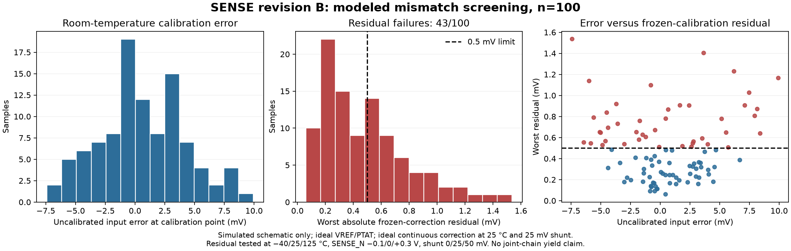

# Revision-B SENSE qualification, 2026-09-21

This is simulated schematic evidence with ideal VREF=1.04 V and ideal PTAT
current. It is not a joint BGR/SENSE/DAC/comparator calibration result.
The 300-sample campaign, PEX mismatch qualification, actual BGR loading,
pad-inclusive checks and physical measurements are **not run** here.

## Model and numerical qualification

The observed EDA image is
`sha256:5fd78498e578c6e9ec10828c248ca3790fc88250ff6caf545521b29e448ea3c0`.
The installed PDK `COMMIT` file reports
`84374023ee8b4b126bebbba67fcbada0a9c0ff0b`; the installation has no Git metadata.
The simulator identifies itself as ngspice 46. Each run directory retains the
complete model-file SHA-256 inventory, source hashes, deck, live log and
solver/watchdog manifest. No PDK model or rule deck changed.

PDK `sg13g2_moshv_mod_mismatch.lib` and `resistors_mod_mismatch.lib` default
`mm_ok=0`. The revision-B schematic explicitly enables mismatch for the MOS
and resistor instances. The PEX conversion omits that flag: merely selecting
mismatch libraries on that PEX netlist would not enable those device variations.
The local MOS model draws W, L, threshold shift and mobility factor; the resistor
model draws local sheet-resistance/width/length terms. Typical mismatch libraries
are local variation, not a full process ensemble. Capacitors use `cap_typ` and
the testbench load-resistor mismatch remains disabled.

The first solver pilot exposed floating resistor bulk nodes (`sub!`) in the
schematic, including each OTA's nulling resistor. The failed/interrupted pilot
is preserved at `qualification/mc-pilot-20260921-b/`. A derived fixture connects
these nodes to each subcircuit's `vss`, as in the physical substrate connection;
testbench load bulks connect to ground. This changes connectivity in the
simulation fixture, not the model cards. It is not a gmin relaxation. The pre-fix source is preserved in
`../reports/substrate-fix-20260921/g1_sense_before.spice`; the derived netlist is
saved separately. The correction is now explicit as `body=vss` in the schematic
generator, regenerated schematics/netlists and grounded testbench load bulks.

`mc-pilot-20260921-a` is **not run**: Git ownership validation stopped provenance
collection before ngspice launched. Pilots C/D/E completed all 36 operating points
for seed41001. C and D used eight ngspice threads (44.88/46.51s); E used one
(23.01s). All saved numerical rows and all sampled random parameters matched
exactly across those three runs. Setting only `OMP_NUM_THREADS=1` did not change
the simulator's eight threads; the successful change is `set num_threads=1`.

Each sample executes `setseed <seed>` followed by one `reset`, then changes
sources and temperature without another reset. It saves 27 random parameters:
W/L/DEL VTO/mobility factor of both input transistors in all three OTAs, plus
three local mismatch terms of R1N. All 27 fingerprints remained identical during
25 → −40 → 125 → 25 °C in the completed pilots; returning to25 °C reproduced all saved
rows. This validates selected parameter identity within this netlist, not paired
physical devices across schematic and PEX netlists. Finger-split PEX statistical
scaling still requires qualification.

## Smoke campaign

Run directory: `qualification/mc-smoke-20260921-a/`. Seeds41001–41020, 120s
watchdog per sample, three shunt points0/25/50 mV and three SENSE_N levels
−0.1/0/+0.3 V at25/−40/125/25°C. These SENSE_N levels preserve the legacy fixture;
the arithmetic mean input common mode is SENSE_N+Vsh/2. Thus this smoke is not
complete exact-common-mode endpoint coverage. The independent corner screen uses
actual mean common mode.

The calibration diagnostic fits an ideal continuous offset at25°C, SENSE_N=0,
Vsh=25mV and freezes that correction at other points with gain fixed at20. Its
0.5mV comparison is an optimistic SENSE-only residual check. It does not establish
that the correction is reachable through a DAC code, compensate two comparator
offsets, or verify the total threshold budget. Gain is checked separately against
20±0.1. Complete numerical and acceptance counts are recorded in `analysis.json`.

Reproduce from repository root (use a **new** run ID; existing IDs are rejected):

```sh
G1_WORKDIR=designs/g1-guardian/blocks/g1_sense/sim flow/run.sh python3 run_qualification.py --run-id NEW_ID --samples 20 --mode mc --image-id sha256:5fd78498e578c6e9ec10828c248ca3790fc88250ff6caf545521b29e448ea3c0
python3 designs/g1-guardian/blocks/g1_sense/sim/analyze_qualification.py designs/g1-guardian/blocks/g1_sense/sim/qualification/NEW_ID
```

The image ID argument records the value observed by host `docker image inspect`;
it is not itself a verification of the executing container image. The runner
independently checks the PDK COMMIT and saves the installed model hashes.

## Completed smoke results and substrate correction

All 20 samples completed all 36 points (720OP), with 0 solver failures and 0timeouts.
All 20 sampled random-parameter fingerprints stayed fixed across temperature and
all 20 returned exactly to their first25°C outputs. The uncalibrated shunt-referred
input-error mean is +0.9591mV and population sigma 3.4457mV in this small ensemble.
The frozen ideal continuous correction **failed** the 0.5mV target in 8/20 samples;
worst absolute residual is 0.9055mV. Gain passed20±0.1 in all 20 samples. These are
screening counts, not a calibrated joint-chain yield estimate.

The worst sample, seed 41016, occurs at 125°C, SENSE_N=−0.1V and shunt0mV.
An algebraic decomposition relative to its 25°C calibration point attributes
0.877485mV to the change in main-OTA closed-loop input differential,
0.002150mV to pedestal drift and 0.025865mV to the remaining resistor-network
term. The main term is `−21/20 × delta(VP−VN)`; it is a circuit diagnostic,
not a separately simulated intrinsic offset distribution.

With explicit substrate connection, both 3.3V and 3.6V AC/4µs step fixtures
completed. The formerly failing 3.6V case gives simulated gain 19.98425 and
bandwidth 4.20396MHz;3.3V gives 19.988 and 4.10947MHz. Evidence is
`qualification/highrail-20260921-a/`. The previous floating-bulk results are
retained; their AC/CMRR values should not be silently combined with the new
physical-bulk fixture. For example, corrected 3.3V common-mode gain at 1 MHz is
−49.9463dB, whereas the old schematic table reports−36.3dB.

The regenerated simulation netlist is byte-identical to the passed AC fixture;
the regenerated CDL is byte-identical to the existing physical LVS reference.
Fresh LVS of the filled macro passed with 0warnings/0errors using the unmodified
PDK deep-mode deck with `--no_series_res` (7.533s). See
`../reports/substrate-fix-20260921/equivalence.json`, `lvs_provenance.json` and
`lvs/`. DRC was **not run** for this source correction: layout geometry and the
LVS reference are unchanged; prior geometry checks retain their original scope.

PEX mismatch qualification remains **not run**. Static inspection maps each main
OTA input leg to sixteen 6 µm/2 µm PEX instances versus one 96 µm/2 µm, ng=16
schematic instance. Independent threshold-shift variance nominally averages with
total device area, but independent per-instance W/L perturbations need a separate
scaling check. Adding `mm_ok=1` without that check would not by itself qualify a
paired schematic/PEX statistical comparison. Equal integer seeds across these
netlists do not identify the same physical devices.

## Independent DC corners

`qualification/corners-20260921-a/` completed **108/108 tuples, 972/972 OP points**,
with zero numerical failures/timeouts and zero gain-limit failures. The sweep is
MOS tt/ss/ff × resistor typ/bcs/wcs × VDDA3.0/3.3/3.6V × T−40/27/85/125°C,
with actual mean input common mode−0.1/0/+0.3V and shunt0/25/50mV per tuple.
`V(SENSE_N)=VCM−Vsh/2`, so both endpoints refer to true average common mode.
The simulated gain range is19.9777–19.99074; maximum supply current is1.39743mA.
VREF/PTAT remain ideal. These are DC results; adverse PEX stability/bandwidth,
actual BGR bias, pad loading and terminal-voltage audit are **not run** here.

```sh
G1_WORKDIR=designs/g1-guardian/blocks/g1_sense/sim flow/run.sh python3 run_qualification.py --run-id NEW_ID --mode corner --image-id sha256:5fd78498e578c6e9ec10828c248ca3790fc88250ff6caf545521b29e448ea3c0
python3 designs/g1-guardian/blocks/g1_sense/sim/analyze_corners.py designs/g1-guardian/blocks/g1_sense/sim/qualification/NEW_ID
```

## Nominal noise characterization

`qualification/noise-20260921-b/` completed the schematic `.noise` analysis at
27°C,3.3V, ideal4.13µA bias, real conditioner resistors/MIM hold and300fF output
wiring load. The ngspice integrated totals over1Hz–10MHz are1.580663mV output RMS
and110.833µV input RMS; all281 spectral points are saved. These are model-based
simulated noise figures, not measured noise. There is no adopted noise acceptance
allocation and no aliasing/decision-aperture weighting, BGR noise or pad model.
A direct trapezoidal integral of the saved PSD gives1.58113mV/108.731µV; its
input-total difference from ngspice is retained in `analysis.json`, not hidden as
more precision than the sweep supports. Finer-grid runs C/D completed at200/1000points per decade. The finest grid
(`noise-20260921-d/`) gives1.580816mV output RMS and108.808µV input RMS;
direct PSD integration gives1.580816mV/108.725µV. The input difference falls
from about1.9% at40points/decade to0.076% at1000points/decade. Use the finest-grid
result for characterization; this is numerical convergence, not a physical
noise-validation claim.

Pilot `noise-20260921-a` is retained as a different fixture: its constant bias
was the25°C value4.10248µA and it omitted the300fF wiring load. Use pilotB for
the stated27°C nominal fixture.

## Expanded 100-sample screen

The qualified 20-sample smoke was extended with80 new seeds in four independent
20-sample processes (`mc-screen-20260921-b1` through `b4`), all on one ngspice
thread per process. The original20 seeds are retained, not re-counted. The
combined result is in `mc-screen-20260921-b1/analysis.json`; the JSON explicitly
lists all five source directories. Each batch retains its exact generated source,
decks, seed, model hashes, solver exit and watchdog status.

| Check | Result |
| --- | --- |
| Solver completion | **passed**:100/100 samples,3600/3600 OP points;0 failed solvers,0 timeouts |
| Frozen sampled random parameters / return to25°C | **passed**:100/100 |
| Gain20±0.1 at the tested points | **passed**:100/100 |
| Residual<0.5mV after ideal frozen one-point correction | **failed**:43/100 samples; maximum1.5361mV |
| Uncalibrated input error (simulated) | mean+0.6213mV; population sigma3.6218mV |
| Full physical/code-calibrated joint-chain yield | **not run** |
| 300-sample critical-chain campaign | **not run** |

An additional offline headroom diagnostic uses each sample's ISENSE/VREF_BUF at
25mV interior calibration and an ideal DAC transfer`(255+code)/530`, with zero
comparator offset. Positive correction raises the DAC code. Under that diagnostic,
52/100 samples clip default hard code254 after signed correction;0/100 clip soft
code153. This omits actual DAC loading, switch mismatch, BGR variation and both
comparator offsets, so it is not joint-chain yield. It does show that SENSE-only
modeled offsets exercise the separately established positive trim-headroom limit.



The plot source is `plot_qualification.py`; renderer provenance is saved beside
the figure. The screen did not silently discard bad electrical samples: all100
are included in the distribution and the43 residual failures remain failures.

## Isolated input-pair area sensitivities — not adopted

The three largest baseline residuals (seeds41022/41070/41064) were deliberately
selected for a controlled sensitivity. Only the main OTA input pair changes:
W96µm/ng16 becomes W384µm/ng64 (4× area), then W1536µm/ng256 (16× area), at L2µm.
The two buffer OTAs remain unchanged. Candidate sources are separate derived
netlists; the accepted schematic/layout is not replaced. Nineteen unaffected
sampled random parameters agree exactly with baseline, and the two target devices'
underlying W/L/threshold/mobility draws agree after normalizing the intended area
scaling (`compare_pair_sensitivity.py`). This is common-random-number comparison,
not an independent ensemble or a physical pairing between different layouts.

| Selected seed | Baseline residual(mV) | 4× pair(mV) | 16× pair(mV) |
| --- | ---: | ---: | ---: |
| 41022 |1.53610|0.87225 **failed**|0.56735 **failed**|
| 41070 |1.40350|0.84600 **failed**|0.59000 **failed**|
| 41064 |1.22900|0.69500 **failed**|0.45150 passed on selected points|

Both candidates retain DC gain within20±0.1 in these selected samples. They do not
close the residual requirement, and their unchanged compensation behaves poorly:
nominal4× pair has3.7–3.9dB AC peaking and32–33% step overshoot at3.3/3.6V;
16× pair has14.5dB peaking and78–80% overshoot. Saved16× step traces last leave the
±1% band2.17–2.53µs after the step. A first99% crossing is not settled behavior.
Phase/gain margin is **not run** and no stability margin is inferred from bandwidth.

Evidence: `mc-pair4-selected-20260921-a/`, `mc-pair16-selected-20260921-a/`,
`highrail-pair4-20260921-a/`, `highrail-pair16-20260921-a/` under `qualification/`.
The larger pair changes transconductance as well as mismatch; these results do
not prove that input-pair threshold mismatch alone dominates the original error.
Changing compensation, current-mirror geometry or topology needs a separate
controlled campaign. Candidate layout, DRC/LVS/PEX and full ensemble are **not run**.

## Folded-sink and upper-mirror drift sensitivity — not adopted

Counterfactual parameter attribution for worst baseline seed41022 replaces W/L,
threshold shift and mobility perturbation in one main-OTA device group with its
nominal values, after the original seed/reset. It changes instance parameters,
not model cards. The input pair, folded sinks M3/M4, upper mirrors
M14/M11/M15/M12 and cascodes M13/M16 were tested separately. Their worst frozen
residuals are respectively1.40605,0.60465,1.08620 and1.54290mV, compared with
baseline1.53610mV. Thus folded-sink and upper-mirror mismatch deserve attention;
input-pair area sensitivity alone did not identify the dominant local variation.
These single-sample interventions are not a variance decomposition or yield.

All four counterfactuals completed36OP with frozen parameters and no solver
failures. Evidence is `mc-attribution-{input,fold,mirror,cascade}-20260921-a/`.
The first fold run retains filenames `XM4.*` after an early name-shadowing bug;
its summary and archived deck correctly identify seed41022. Subsequent filenames
are corrected. The explicit before/after and temperature parameter prints remain
in every log. Untargeted observed parameters match baseline exactly; see each
`fingerprint_comparison.json`.

An isolated physical geometry candidate doubles W and L of the folded sinks and
upper mirrors, preserving W/L while increasing their area4×. Gate-finger count
doubles to retain per-finger width. Main input pair and buffer OTAs are unchanged.
The derived source is retained separately in `mc-matching4-selected-20260921-a/`.
All27 observed unaffected sample parameters exactly match each baseline seed;
these fingerprints do not include the resized devices and do not establish a
physical sample identity between different layouts.

| Selected seed | Baseline residual(mV) | 4× folded/mirror area(mV) |
| --- | ---: | ---: |
|41022|1.53610|1.02610 **failed**|
|41070|1.40350|1.00800 **failed**|
|41064|1.22900|0.92700 **failed**|

All108OP completed, with zero solver failures and gain within20±0.1. Nominal
AC/step regression `highrail-matching4-20260921-a/` passed at3.3/3.6V: gain
19.97825/19.97275, bandwidth4.22339/4.36715MHz, zero observed AC peaking and
step overshoot0.0400/0.1502%. Phase margin, PEX, candidate layout/DRC/LVS and a
candidate ensemble are **not run**. The residual requirement remains failed;
this candidate is not adopted. A two-point inverse-square-root extrapolation
cannot establish a statistical variance or guarantee that further area closes
this requirement, particularly with the input-pair and other groups unchanged.
