Revision B adds actual GDS views and saved simulation curves alongside each block review. All curves are simulated; unavailable waveform or post-layout coverage is identified explicitly.

## Contents

- [Review disposition](#review-disposition)
- [System architecture and design decisions](#system-architecture-and-design-decisions)
- [G1_BGR: reference and PTAT bias](#g1_bgr-reference-and-ptat-bias)
- [G1_T2F: temperature-to-frequency, revision 2](#g1_t2f-temperature-to-frequency-revision-2)
- [G1_OSC: system clock, revision 5](#g1_osc-system-clock-revision-5)
- [G1_DOSE: direct analog dose-monitor test devices](#g1_dose-direct-analog-dose-monitor-test-devices)
- [G1_DUT: single accessible SiGe HBT](#g1_dut-single-accessible-sige-hbt)
- [G1_SENSE](#g1_sense)
- [G1_TRIP](#g1_trip)
- [G1_GATE](#g1_gate)
- [G1_TOP](#g1_top)
- [Built against and assembly identification](#built-against-and-assembly-identification)
- [G1_CTRL and G1_SEU](#g1_ctrl-and-g1_seu)
- [Internal level shifters](#internal-level-shifters)
- [Assembly and padframe](#assembly-and-padframe)
- [Sign-off evidence and open failures](#sign-off-evidence-and-open-failures)
- [Extraction scope and evidence limitations](#extraction-scope-and-evidence-limitations)
- [Open-item register and release gates](#open-item-register-and-release-gates)
- [Artifact index and reproduction map](#artifact-index-and-reproduction-map)
- [Schematic overview sheets](#schematic-overview-sheets)
- [Bounded restart diagnostics](#bounded-restart-diagnostics)

```{=openxml}
<w:p><w:r><w:br w:type="page"/></w:r></w:p>
```

# Review disposition

**NOT READY FOR TAPE-OUT SIGN-OFF.** This document consolidates the implemented design and the evidence available on 21 September 2026. It follows an engineering design-review structure; it is not a foundry approval, a certificate of compliance with a particular standard, or authorization to submit GDS.

The main analog blocks and the digital core have been implemented and individually checked. An assembled 1.35 × 1.35 mm GDS exists and passes the prescribed hard-rule geometry checks, density, digital timing and core-only LVS. Important electrical, IO-inclusive verification and packaging questions remain open. No fabricated samples or physical measurements exist.

The eight corrected schematic chip-path runs and three longer behavioural runs completed. The integrated block-PEX hard-trip and first power-up runs were interrupted without results. Post-layout checks exist for the six main analog blocks, but not for every auxiliary block: standalone level-shifter and DOSE/DUT PEX/post-layout remain not run.

| Review control | Record |
| --- | --- |
| Document ID / revision | G1-DR-001 / B |
| Design of record | G1 Guardian, assembly-1350; digital run7; T2F revision 2; OSC revision 5 |
| Evidence cutoff | Saved block results plus new bounded restart diagnostics on 21 September 2026; see the final appendix |
| Overall disposition | Open findings; no sign-off approval |
| Design review approval | not run — human review required |
| Verification approval | not run — open findings remain |
| Packaging / final submission approval | not run |

## How to read the evidence

All performance numbers are simulated unless explicitly marked as a hand estimate. “Passed” applies only to the named check, conditions and model. “Failed” includes executed numerical or functional failures. “Not run” includes work not attempted; interrupted attempts are explicitly “not run to completion.” “Not applicable” is used only where the check does not apply. A partial measurement from an aborted run is not a completed verification pass.

Every artifact path is relative to the silicon repository root. Where a section declares a block root, shorter paths within that section are relative to that root. Literal paths identify files on disk; wildcard paths identify a family of reports, not a single completed check. The final GDS under flow/runs is a gitignored local build artifact; it must be included explicitly in any later submission package with its hash. Source definitions and extracted or generated views are distinguished throughout.

Existing summaries contain inconsistencies. This review favors current wrappers, actual artifact contents, source hashes and raw logs over older completion prose. Discrepancies that cannot be resolved from evidence remain open rather than silently being treated as passes. Supporting sources are identified alongside each block; detailed test matrices remain in the referenced result files.

# System architecture and design decisions

G1 combines a low-side load breaker with temperature telemetry and radiation-characterization structures. It is a test chip: the dose canary and redundant-register geometry do not establish measured radiation hardness or a calibrated dose response.

The breaker signal path is external Kelvin shunt → SENSE gain/pedestal → conditioned soft/hard comparators and DACs → digital persistence/inrush/retry logic or optional analog fast path → GATE latch/IO driver → external FET. BGR provides reference and bias; OSC provides the digital clock and the controller divides it for comparator strobes. T2F uses BGR bias/reference and sends a frequency through TEMP_OUT. DOSE and DUT terminate directly at analog pads for off-chip characterization. CTRL/SEU shares the three-wire serial port.

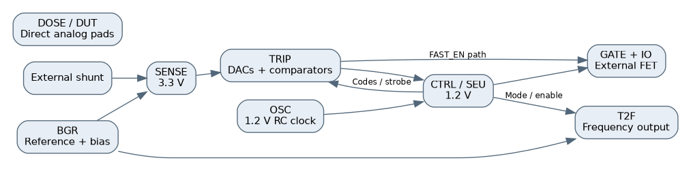{width=6.3in}

## Decisions embodied in the current sources

1. **1350 µm die and 24-pad ring.** Earlier smaller floorplans could not accommodate actual IO geometry and macro area. The final core window is 622 µm square; the 12 instances occupy about 71% before routing overhead.
2. **Separate analog supply on pin 7.** Directly reaching the ring IOVDD rail from the core created rail-crossing problems. VDDA enters through an analog pad bare terminal and custom supply mesh; board VDDA and IOVDD are tied to one 3.3 V rail.
3. **Reference near 1.04 V, not a generic 1.2 V bandgap.** Downstream pedestal and DAC scaling reflect the modeled SiGe reference. HBT collector cascodes enforce voltage limits; T2F revision 1 is superseded because its HBT VCE exceeded the limit.
4. **SENSE gain 20 with a pedestal and buffered VREF.** The two-stage OTA and reference buffer address loaded gain and DAC drive. Offset remains a verification issue, not automatically solved by layout.
5. **Two threshold/time paths.** Digital persistence rejects short load excursions; optional FAST_EN bypasses that filtering through the analog latch. The soft accumulator is I²t-like logic, not an analog measurement of current squared. Hard threshold range is limited by the full-scale shunt/DAC mapping.
6. **HV DAC switch trees and sample retention.** These address hot leakage and comparator kickback at an area/capacitance cost. Comparator routing was revised after extracted asymmetry produced offset.
7. **1.2 V RC clock with trim.** Actual OSC operates from VDD, despite obsolete 3.3 V descriptions. Tested trim endpoints bracket 10 MHz; an ideal clock in the system testbench is a declared model substitution.
8. **256 plain / 128-per-copy TMR stages.** The larger early SEU plan did not fit. Synthesis preservation plus spatial separation maintains physical redundant copies; radiation tolerance remains unmeasured.
9. **HV/LV PCell dose pair as default.** The drawn ELT alternative fails the bent-gate rule and is not the default assembly. D_ELT is a legacy pad name, not proof that an ELT is present.
10. **External TRIP_SET override not implemented.** Its pad exists, but there is no core consumer. Software/register behavior must not imply the pin has an active override function.

Source decision trail: `designs/g1-guardian/PLAN.md`, block READMEs, `designs/g1-guardian/specification/G1_TOP_LEVEL_SPECIFICATION.md`, `designs/g1-guardian/specification/G1_REGISTER_MAP.md`, and the integration wrapper identified below. Older alternatives are not the views of record.

```{=openxml}
<w:p><w:r><w:br w:type="page"/></w:r></w:p>
```

## Full-chip physical layout: 1.35 mm assembly

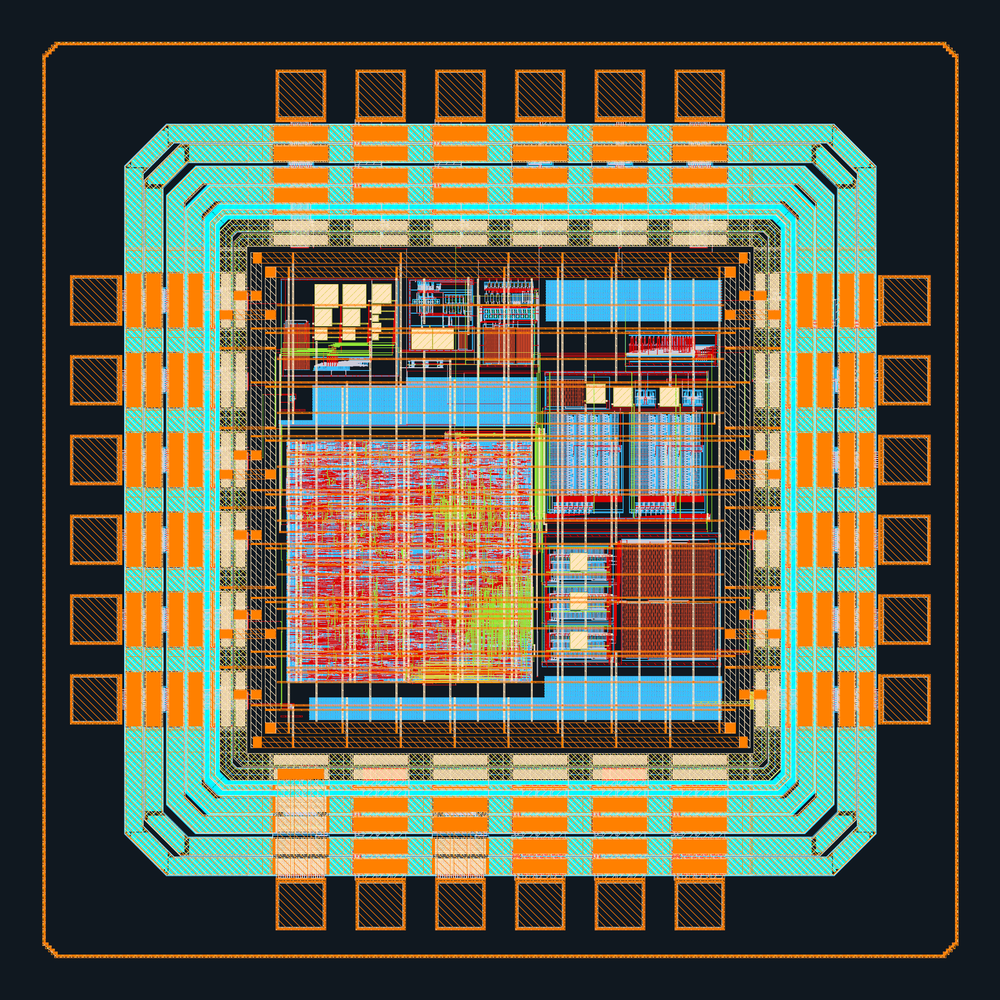{width=5.10in}

Actual GDS view: 1350.00 × 1350.00 µm bounding box; +x right, +y up. Source: `designs/g1-guardian/blocks/g1_padring/flow/runs/assembly-1350/final/gds/g1_chip_top.gds`. This is the assembled chip geometry. The display shows selected physical layers; hidden fill, well and recognition layers remain in the source GDS. See the chip-view legend and layout manifest for rendering scope.

{width=6.2in}

Layout images use the PDK colors and patterns with a display-only layer selection; they do not modify the GDS or extraction layer map. Exact input GDS hashes, dimensions and rendering configuration are in `designs/g1-guardian/review/layouts/layout_manifest.json`.

```{=openxml}
<w:p><w:r><w:br w:type="page"/></w:r></w:p>
```

## Assembled core: block-location key

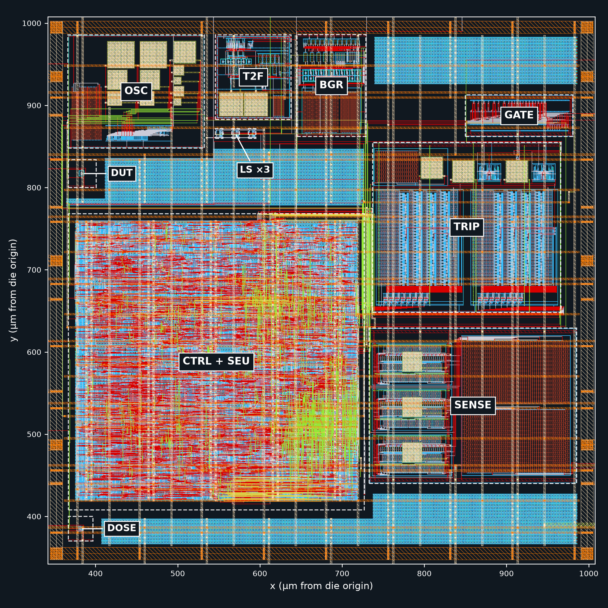{width=5.10in}

Macro labels follow the recorded instance bounding boxes in the assembled GDS; see `designs/g1-guardian/review/layouts/assembly_placements.json` and the layout manifest for source and transformation provenance. The shared digital macro contains CTRL and SEU.

```{=openxml}
<w:p><w:r><w:br w:type="page"/></w:r></w:p>
```

## Analog provenance and interpretation

BGR, T2F, OSC, DOSE and DUT name open IHP SG13G2 PDK commit `84374023ee8b4b126bebbba67fcbada0a9c0ff0b`, ngspice 46, KLayout 0.30.9. BGR/T2F/OSC use xschem 3.4.8RC and kpex 0.3.12 for capacitance extraction. Device-block ngspice and PDK evidence is `designs/g1-guardian/blocks/g1_dut/sim/logs/ngspice_banner.txt` and `designs/g1-guardian/blocks/g1_dut/sim/logs/pdk_commit.txt`; DOSE has corresponding files. DRC/LVS run logs establish KLayout version. Model temperatures below −40 °C or above 125 °C are extrapolations, including the reported 150/175 °C results. No silicon measurement has run.

Block-level DRC below is the full main + maximal rule set with `--no_density`, not a chip-density approval. Existing README integration “not run” entries can be older than chip assembly; use the assembly report for current chip-level state. A finished test with no defined electrical acceptance limit establishes characterization, not a blanket performance pass.

# G1_BGR: reference and PTAT bias

Block root: `designs/g1-guardian/blocks/g1_bgr/`.

Architecture: first-order current-mode, amplifier-free, 3.3 V bandgap. A 1:8 `npn13G2` area ratio generates delta-VBE across 13.4 kΩ rppd; cascoded HV PMOS mirrors deliver PTAT current. NMOS collector cascodes protect the HBTs and suppress the avalanche-driven supply dependence observed in an earlier topology. A copy into 82 kΩ plus a diode HBT produces the reference. The zero-TC target is approximately 1.04 V for the modeled SiGe junction, so downstream DAC scaling uses 1.04 V. A mirror-current detector releases a weak startup pull-down once current flows. Diagnostic `r4` changes the area ratio to 1:4. Bias rails feed T2F. Layout uses matched HBT/resistor structures, star-ground return for the PTAT resistor, source-tied isolated PMOS cascode wells, and no-fill regions around matching-sensitive structures.

| Artifact | Repository-relative path |
| --- | --- |
| Schematic | `designs/g1-guardian/blocks/g1_bgr/xschem/g1_bgr.sch` |
| Simulation netlist | `designs/g1-guardian/blocks/g1_bgr/xschem/g1_bgr.spice` |
| LVS reference | `designs/g1-guardian/blocks/g1_bgr/schematic/g1_bgr_lvs.cdl` |
| Layout, 84 × 124 µm | `designs/g1-guardian/blocks/g1_bgr/layout/g1_bgr.gds`, `designs/g1-guardian/blocks/g1_bgr/layout/g1_bgr.lef` |
| Pre-layout results | `designs/g1-guardian/blocks/g1_bgr/sim/results/tables.md` |
| Post-layout model/results | `designs/g1-guardian/blocks/g1_bgr/sim/postlayout/g1_bgr_pex.spice`, `designs/g1-guardian/blocks/g1_bgr/sim/postlayout/results/compare.md` |

Nominal pre-layout: VREF 1.03786 V, IPTAT 4.1341 µA, total current 22.038 µA at 27 °C/3.3 V; box TC 25.07 ppm/°C over −40…125 °C. The 27 HBT/MOS/resistor combinations × three supplies produce 1.0288…1.0488 V at 27 °C and 11.0…52.2 ppm/°C TC. Startup acceptance passes 81/81 fast-ramp cases (1 ms ramp) and 29/29 slow-ramp cases (100 ms). Mismatch MC, 300 samples: VREF sigma 19.1 mV (1.84%). These establish substantial schematic coverage, not precision after package stress or radiation.

Post-layout capacitance-model nominal: VREF 1.03931 V, +1.45 mV from resistor segmentation/head effects; TC 22.56 ppm/°C. Startup reaches 0.93 V at 0.5188 ms vs schematic 0.5198 ms. PSRR transfer at 1 kHz changes −82.3 to −75.3 dB. This is model-dependent: the extraction lacks a well conductor; moving selected well-related substrate capacitors to VDD changes it to −79.6 dB, and removing parasitics gives −82.1 dB. Treat this as sensitivity evidence, not an established physical PSRR bound. A separate **estimated wire-resistance** variant gives VREF 1.03734 V and IPTAT 4.1029 µA; it is not extracted RC. Actual RC extraction was attempted but unusable because internal resistor trees were not connected to device terminals.

DRC **passed**, LVS **passed** (32 devices), antenna reported **passed**. Directly checked DRC/LVS logs: `reports/drc/drc_run_2026_09_19_10_53_29.log`, `reports/lvs/lvs_run_2026_09_19_10_53_29.log` (block-relative). Gaps: full post-layout 27-corner sweep, post-layout mismatch, 100 ms post-layout startup, loop-gain/phase and noise **not run**. Fill coupling excluded by tool; top-level routes outside this model.

Reproduction: `G1_WORKDIR=designs/g1-guardian/blocks/g1_bgr/sim flow/run.sh python3 run_bgr.py all`; analysis `python3 designs/g1-guardian/blocks/g1_bgr/sim/analyze_bgr.py`. Post-layout runner: block-relative `sim/postlayout/run_postlayout.py`.

```{=openxml}
<w:p><w:r><w:br w:type="page"/></w:r></w:p>
```

## G1_BGR: physical layout

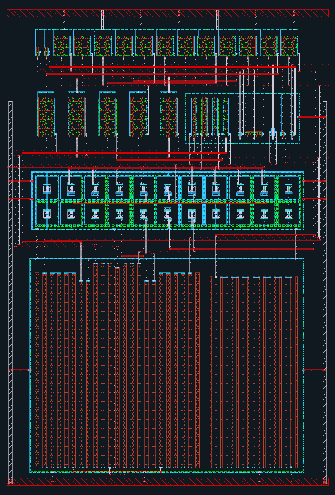{width=3.46in}

Actual GDS view: 84.00 × 124.00 µm bounding box; +x right, +y up. Source: `designs/g1-guardian/blocks/g1_bgr/layout/g1_bgr.gds`. This is the block delivery before any chip assembly transformations. The display shows selected physical layers; hidden fill, well and recognition layers remain in the source GDS. See the chip-view legend and layout manifest for rendering scope.

```{=openxml}
<w:p><w:r><w:br w:type="page"/></w:r></w:p>
```

## BGR: reference and PTAT temperature sweeps

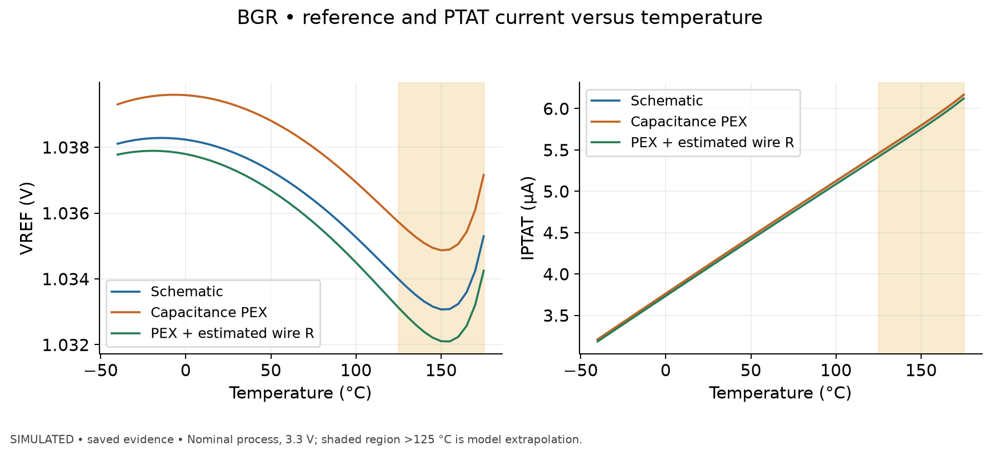{width=6.20in}

**Simulated, saved evidence.** Simulated BGR VREF and IPTAT versus temperature at nominal process and 3.3 V. Blue is the schematic; orange is the device netlist reconstructed for capacitance PEX; green adds hand-estimated wiring resistance. The shaded >125 °C region is model extrapolation. The DC shift between blue and orange results from netlist/device geometry and segmentation differences, not from capacitance changing the DC operating point. Green is a sensitivity estimate, not valid full RC extraction.

At 27 °C the separate OP summaries give VREF 1.03786 V schematic, 1.03931 V in the capacitance-PEX model, and 1.03734 V with estimated wire resistance. The existing block analysis attributes the +1.45 mV device-netlist shift to resistor head/segmentation effects; well-conductor limitations additionally affect AC interpretation. The wire estimate moves IPTAT from 4.1341 to 4.1029 µA. Nominal box TC over −40…125 °C is 25.07 ppm/°C schematic, 22.56 ppm/°C C-PEX and approximately 27.9 ppm/°C with estimated wire R. The plot uses the saved 5 °C sweep samples; the exact 27 °C numbers come from OP evidence, not interpolation of those samples.

Source data: `designs/g1-guardian/blocks/g1_bgr/sim/postlayout/results/temp_hbt_typ_mos_tt_res_typ_3.3.dat`; `designs/g1-guardian/blocks/g1_bgr/sim/postlayout/results/wire_hbt_typ_mos_tt_res_typ_temp_3.3.dat`; `designs/g1-guardian/blocks/g1_bgr/sim/results/temp_hbt_typ_mos_tt_res_typ_3.3.dat`. Extracted plot data: `designs/g1-guardian/review/results/01_bgr_temperature.csv`; input hashes and plotting command: `designs/g1-guardian/review/results/provenance.json`.

```{=openxml}
<w:p><w:r><w:br w:type="page"/></w:r></w:p>
```

## BGR: saved startup transient

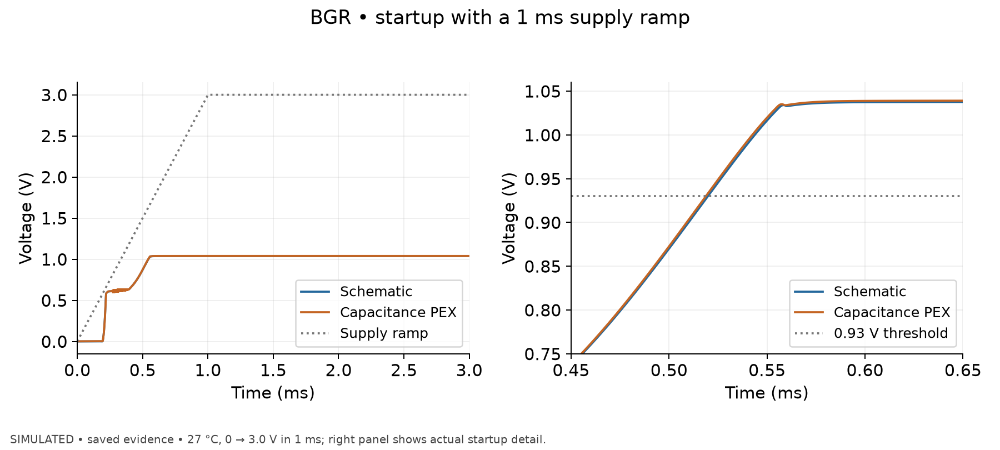{width=6.20in}

**Simulated, saved evidence.** Actual saved transient samples for a 0→3.0 V supply ramp in 1 ms at 27 °C, nominal process. Left: VREF and the applied supply. Right: detail around reference startup; the dotted horizontal line marks 0.93 V. Both models converge to a settled reference within the recorded 3 ms window.

Time to 0.93 V is 0.5198 ms schematic and 0.5188 ms C-PEX. The two traces almost coincide at page scale; this is the observed result, not an omitted difference. This is one fast-ramp nominal case, not post-layout qualification of every corner or the separate 100 ms ramp. Post-layout slow-ramp coverage remains **not run**.

Source data: `designs/g1-guardian/blocks/g1_bgr/sim/postlayout/results/startup_hbt_typ_mos_tt_res_typ_T27_3.0.dat`; `designs/g1-guardian/blocks/g1_bgr/sim/results/startup_hbt_typ_mos_tt_res_typ_T27_3.0.dat`. Extracted plot data: `designs/g1-guardian/review/results/02_bgr_startup.csv`; input hashes and plotting command: `designs/g1-guardian/review/results/provenance.json`.

```{=openxml}
<w:p><w:r><w:br w:type="page"/></w:r></w:p>
```

# G1_T2F: temperature-to-frequency, revision 2

Block root: `designs/g1-guardian/blocks/g1_t2f/`.

Architecture: copies BGR PTAT current to alternately charge two 1.18 pF MIM capacitors. HBT differential comparators and an RS latch switch at VREF; f ≈ IPTAT/(2 C VREF). An alternate REF mode sets threshold to 2 IPTAT RREF. Plain PTAT is the intended calibrated reading; ratio readout is less linear in the final revision. HV-to-LV output shifting produces 1.2 V `fout`. Revision 2 adds NMOS collector cascodes and a threshold-following gate bias: revision 1 HBT VCE reached 3.08 V against a 1.6 V limit, whereas six final monitored conditions have maximum 1.10 V. RREF is explicitly ten series units for one-to-one LVS. Superseded evidence remains under `rev1/`.

| Artifact | Repository-relative path |
| --- | --- |
| Schematics | `designs/g1-guardian/blocks/g1_t2f/xschem/g1_t2f.sch`, `designs/g1-guardian/blocks/g1_t2f/xschem/g1_ref_sensor.sch` |
| Simulation netlist / LVS reference | `designs/g1-guardian/blocks/g1_t2f/xschem/g1_t2f.spice`, `designs/g1-guardian/blocks/g1_t2f/layout/g1_t2f_lvs.cdl` |
| Layout, 92 × 102.6 µm | `designs/g1-guardian/blocks/g1_t2f/layout/g1_t2f.gds`, `designs/g1-guardian/blocks/g1_t2f/layout/g1_t2f.lef` |
| Pre-layout evidence | `designs/g1-guardian/blocks/g1_t2f/sim/results/tables.md`, `designs/g1-guardian/blocks/g1_t2f/sim/results/vce_summary.csv` |
| Post-layout model/results | `designs/g1-guardian/blocks/g1_t2f/sim/postlayout/g1_t2f_pex.spice`, `designs/g1-guardian/blocks/g1_t2f/sim/postlayout/results/compare.md` |

Schematic nominal f(27 °C) 1.6003 MHz PTAT, 1.5978 MHz REF. Two-point calibration at 25/100 °C gives PTAT residual −0.85…+0.17 °C over −40…150 °C (hot end extrapolated); ratio residual reaches +3.78 °C over the same range, so ratio readout does not satisfy a ±2 °C objective across that range. Nine nominal/extreme process points oscillate, frequency −12.2…+14.7%; this is not the full 27-corner set. Supply sensitivity −2.52 °C/V (3.0…3.6 V). Two cold-temperature runs abort after their frequency measurement windows; count their captured frequency as characterization but their complete transient executions as **failed**, not passed. A cold extreme corner needed tighter settings. Cryogenic simulations do not oscillate within their windows and are model extrapolations.

Post-layout nominal f 1.5418 MHz (−3.65%), 63.81 µA from 3.3 V including schematic BGR; supply sensitivity −3.26 °C/V. Sampled calibrated errors: −0.98 °C at −40, +0.03 at 27, −0.29 at 125, +0.39 at 175 °C (last extrapolated). The post-layout test keeps BGR schematic, so this is not both blocks extracted together. PEX conversion consumes partial SPICE plus 398 capacitance entries and restores the two MIM devices; timing-node loads 25/26 fF. MIM plate parasitics, fill coupling, well capacitance and extracted resistance absent. Flat-GDS cross-check identical to hierarchical extraction.

DRC and LVS **passed**, checked `reports/drc/drc_run_2026_09_19_10_50_57.log`, `reports/lvs/lvs_run_2026_09_19_10_50_57.log`. LVS uses `--no_series_res`; 56 nets, 84 merged devices per block record. Antenna reported **passed**. Post-layout corners/MC, oscillator mismatch, jitter/phase noise **not run**. RC extraction **not run** for this block.

Reproduction: `G1_WORKDIR=designs/g1-guardian/blocks/g1_t2f/sim flow/run.sh python3 run_t2f.py all -j 6`; post-layout `G1_WORKDIR=designs/g1-guardian/blocks/g1_t2f/sim/postlayout flow/run.sh python3 run_postlayout.py all`.

## G1_T2F: physical layout

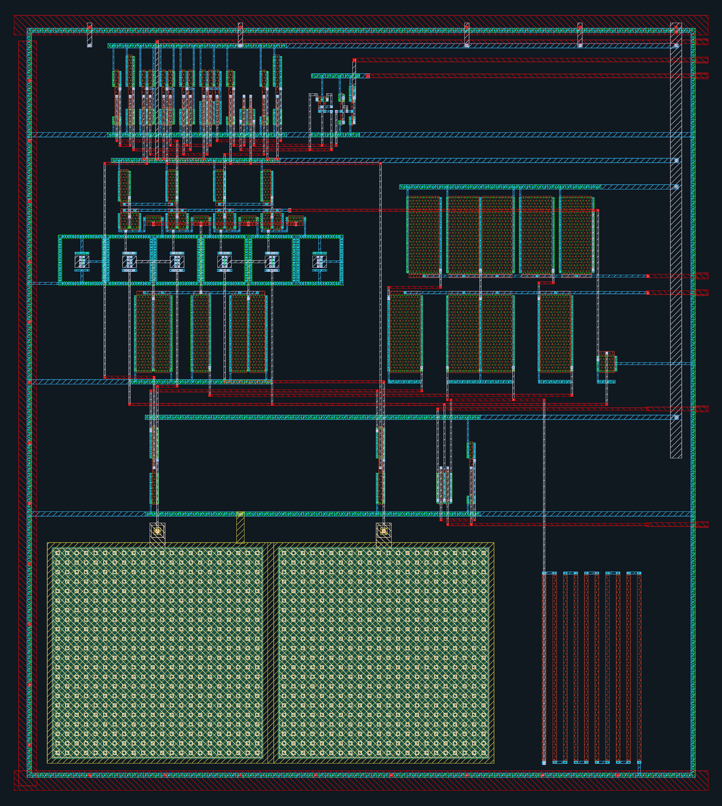{width=4.04in}

Actual GDS view: 92.00 × 102.60 µm bounding box; +x right, +y up. Source: `designs/g1-guardian/blocks/g1_t2f/layout/g1_t2f.gds`. This is the block delivery before any chip assembly transformations. The display shows selected physical layers; hidden fill, well and recognition layers remain in the source GDS. See the chip-view legend and layout manifest for rendering scope.

```{=openxml}
<w:p><w:r><w:br w:type="page"/></w:r></w:p>
```

## T2F: frequency and calibration residual

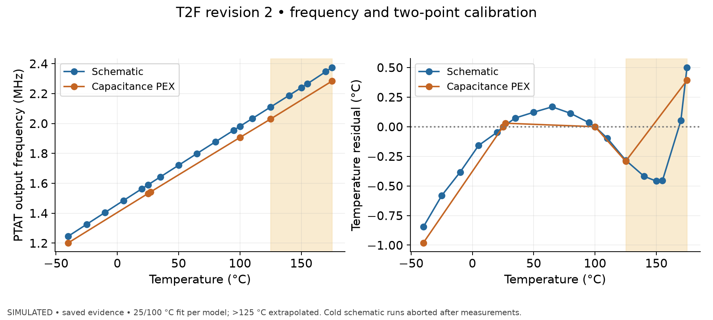{width=6.20in}

**Simulated, saved evidence.** Simulated revision-2 PTAT frequency versus temperature and residual after an independent 25/100 °C two-point fit for each netlist. Markers are saved measurements; the more sparsely sampled orange curve does not imply dense post-layout coverage. BGR remains schematic in the T2F post-layout test. Shading identifies model extrapolation above 125 °C. Cold schematic transient measurements are retained although their complete runs later aborted.

Nominal OP-frequency evidence gives 1.6003 MHz schematic versus 1.5418 MHz C-PEX at 27 °C (−3.65%). The separate 25/100 °C fits absorb most of the gain change. Saved post-layout residual samples are −0.98 °C at −40, approximately +0.03 at 27, −0.29 at 125 and +0.39 at 175 °C. The full schematic sweep shows curvature missed by a sparse post-layout curve; no missing points were fabricated. The script computes residual as `(f(T)−f(25))/((f(100)−f(25))/75)+25−T`. Schematic −40 °C values came from completed measurement windows before subsequent timestep aborts; full-run status is **failed**.

Source data: `designs/g1-guardian/blocks/g1_t2f/sim/postlayout/results/ftemp_summary.csv`; `designs/g1-guardian/blocks/g1_t2f/sim/results/ftemp_summary.csv`. Extracted plot data: `designs/g1-guardian/review/results/03_t2f_calibration.csv`; input hashes and plotting command: `designs/g1-guardian/review/results/provenance.json`.

```{=openxml}
<w:p><w:r><w:br w:type="page"/></w:r></w:p>
```

# G1_OSC: system clock, revision 5

Block root: `designs/g1-guardian/blocks/g1_osc/`.

Architecture: 1.2 V RC ping-pong relaxation oscillator, two resistor-charged MIM banks, comparators against VDD/2, SR latch. Supply-ratiometric threshold makes the ideal half-period RC ln(2); comparator delay causes remaining sensitivity. Four-bit trim gives 1.50 pF fixed +100 fF × code per bank. Fixed capacitance increased from 1.43 pF to center fast-corner trim; final revision adds an antenna diode at `vth`. Enable resets/discharges banks. No analog divider; digital control derives comparator strobe from `osc_clk`.

| Artifact | Repository-relative path |
| --- | --- |
| Schematic and subcells | `designs/g1-guardian/blocks/g1_osc/schematic/g1_osc.sch` (comparator, capacitor-bank, inverter, NOR and NAND schematics alongside) |
| Simulation netlist / LVS reference | `designs/g1-guardian/blocks/g1_osc/sim/netlist/g1_osc.spice`, `designs/g1-guardian/blocks/g1_osc/layout/g1_osc_lvs.cdl` |
| Layout, 166 × 137.6 µm | `designs/g1-guardian/blocks/g1_osc/layout/g1_osc.gds`, `designs/g1-guardian/blocks/g1_osc/layout/g1_osc.lef` |
| Pre-layout / post-layout results | `designs/g1-guardian/blocks/g1_osc/sim/results_osc.txt`, `designs/g1-guardian/blocks/g1_osc/sim/postlayout/results_postlayout.txt` |
| Post-layout model | `designs/g1-guardian/blocks/g1_osc/sim/postlayout/g1_osc_pex.spice` |

Schematic nominal code 8: 9.91864 MHz; post-layout 8.99442 MHz, 49.5358% duty, 110.062 µA. Post-layout nominal trim endpoints 12.9268 MHz (code 0), 7.17423 MHz (15). Fast corner brackets 10 MHz with codes 11/12: 10.3423/9.94519 MHz; slow with 0/1: 10.3696/9.85706 MHz. Thus 10 MHz lies within trim range at the tested extremes, not necessarily an exact available code. At code 8 nominal process, 1.08/1.32 V gives 8.78508/9.14982 MHz and −40/125 °C gives 9.04077/8.90713 MHz. Supply ramp first edge 0.500565 µs; end frequency 8.99459 MHz.

PEX conversion lists 609 parasitic capacitors (608 after excluding one same-node entry); timing nodes approximately 42 fF each. Source layout is flattened and MIM-related layers removed for extraction, with eleven capacitor devices restored afterward. Hence plate-to-wire coupling, fill coupling, extracted wire resistance, and a true full stack MIM extraction are absent. Do not interpret existing model as full physical RC.

DRC and LVS **passed**, checked `reports/drc/drc_run_2026_09_19_12_25_16.log`, `reports/lvs/lvs_run_2026_09_19_12_25_50.log`; antenna reported **passed**. Mismatch MC **not run**; full post-layout PVT matrix **not run** (selected cases exist). Reproduction: `G1_WORKDIR=designs/g1-guardian/blocks/g1_osc/sim flow/run.sh bash run_osc.sh all`; post-layout runner `sim/postlayout/run_postlayout.sh`.

## G1_OSC: physical layout

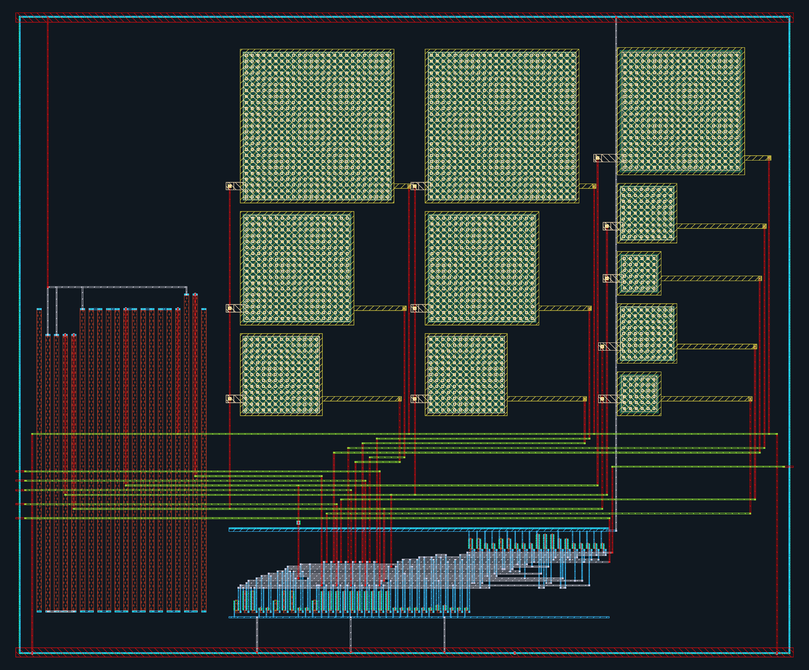{width=6.16in}

Actual GDS view: 166.00 × 137.57 µm bounding box; +x right, +y up. Source: `designs/g1-guardian/blocks/g1_osc/layout/g1_osc.gds`. This is the block delivery before any chip assembly transformations. The display shows selected physical layers; hidden fill, well and recognition layers remain in the source GDS. See the chip-view legend and layout manifest for rendering scope.

```{=openxml}
<w:p><w:r><w:br w:type="page"/></w:r></w:p>
```

## OSC: schematic versus extracted trim response

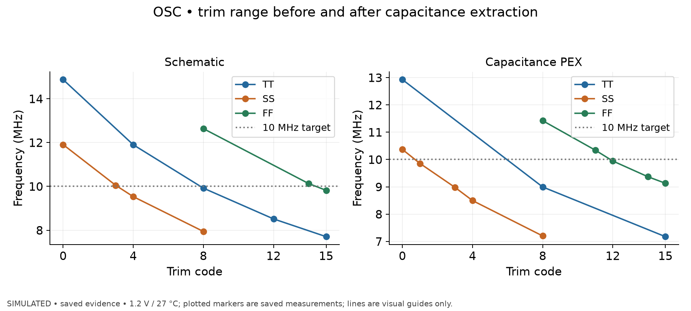{width=6.20in}

**Simulated, saved evidence.** Saved schematic and capacitance-PEX oscillator frequencies at 1.2 V/27 °C for nominal and paired process extremes. Each marker is an executed code; connecting lines are visual guides and do not represent new intermediate-code simulations. The dotted line is the 10 MHz target.

Nominal code 8 falls from 9.91864 to 8.99442 MHz after capacitance extraction (approximately −9.3%). PEX slow corner brackets 10 MHz at codes 0/1 (10.3696/9.85706 MHz); fast corner at 11/12 (10.3423/9.94519 MHz). Thus the tested trim ranges bracket 10 MHz, but quantization prevents claiming an exact 10 MHz code in every case. Schematic and post-layout sample sets differ. PEX omits fill coupling and MIM plate-to-wire coupling; it is capacitance-only.

Source data: `designs/g1-guardian/blocks/g1_osc/sim/postlayout/results_postlayout.txt`; `designs/g1-guardian/blocks/g1_osc/sim/results_osc.txt`. Extracted plot data: `designs/g1-guardian/review/results/04_osc_trim.csv`; input hashes and plotting command: `designs/g1-guardian/review/results/provenance.json`.

```{=openxml}
<w:p><w:r><w:br w:type="page"/></w:r></w:p>
```

# G1_DOSE: direct analog dose-monitor test devices

Block root: `designs/g1-guardian/blocks/g1_dose/`.

Final default macro uses PCell HV NMOS (W/L 3.98/0.45 µm) on pad named `D_ELT` and LV NMOS (3.98/0.13 µm) on `D_STD`, shared gate/source/body. **The default is not an enclosed-layout transistor**, despite the pad name. The ELT alternative is LVS-clean but **fails Gat.f** in full DRC and is not the default. A narrow/wide LV alternative also exists. Purpose is off-chip device characterization; no on-chip log-ratio converter and no radiation damage model.

| Artifact | Repository-relative path |
| --- | --- |
| Default circuit reference (CDL; no dedicated xschem schematic found) | `designs/g1-guardian/blocks/g1_dose/schematic/g1_dose_pair_pcell.cdl`, `designs/g1-guardian/blocks/g1_dose/schematic/g1_dose_macro.cdl` |
| Default macro, 30 × 30 µm | `designs/g1-guardian/blocks/g1_dose/layout/g1_dose_macro.gds`, `designs/g1-guardian/blocks/g1_dose/layout/g1_dose_macro.lef` |
| Optional layouts | `designs/g1-guardian/blocks/g1_dose/layout/g1_dose.gds` (ELT), `designs/g1-guardian/blocks/g1_dose/layout/g1_dose_nw.gds` |
| Simulation evidence | `designs/g1-guardian/blocks/g1_dose/sim/results_variants.md`, `designs/g1-guardian/blocks/g1_dose/sim/results.md` |

At 27 °C, TT, VGS=0 and VDS=0.1 V: HV leakage 7.92e−14 A, LV 3.97e−11 A, ratio 501. This is a pre-irradiation simulated baseline only. The ratio is strongly temperature-dependent (3800 at −40 °C, 66.3 at 125 °C); do not carry the ELT-pair temperature-cancellation claim over to the HV/LV default. The very low HV current makes real pad leakage critical. Three MOS corners × four characterized temperatures were simulated; 150/175 °C rows are extrapolated. No dose-response prediction is supported by the PDK.

Filled macro DRC/LVS **passed**, verified `reports/drc_macro/drc_run_2026_09_19_11_01_21.log`, `reports/lvs_macro/lvs_run_2026_09_19_11_01_56.log`. PEX/post-layout and mismatch **not run**. Block antenna/density **not run**. Shared-gate exposure-bias policy and pad-leakage floor remain unresolved in the block record; top-level bench/interface audit should reconcile them. Reproduction runner: `G1_WORKDIR=designs/g1-guardian/blocks/g1_dose/sim flow/run.sh bash run_offcurrent_variants.sh`.

```{=openxml}
<w:p><w:r><w:br w:type="page"/></w:r></w:p>
```

## G1_DOSE: physical layout

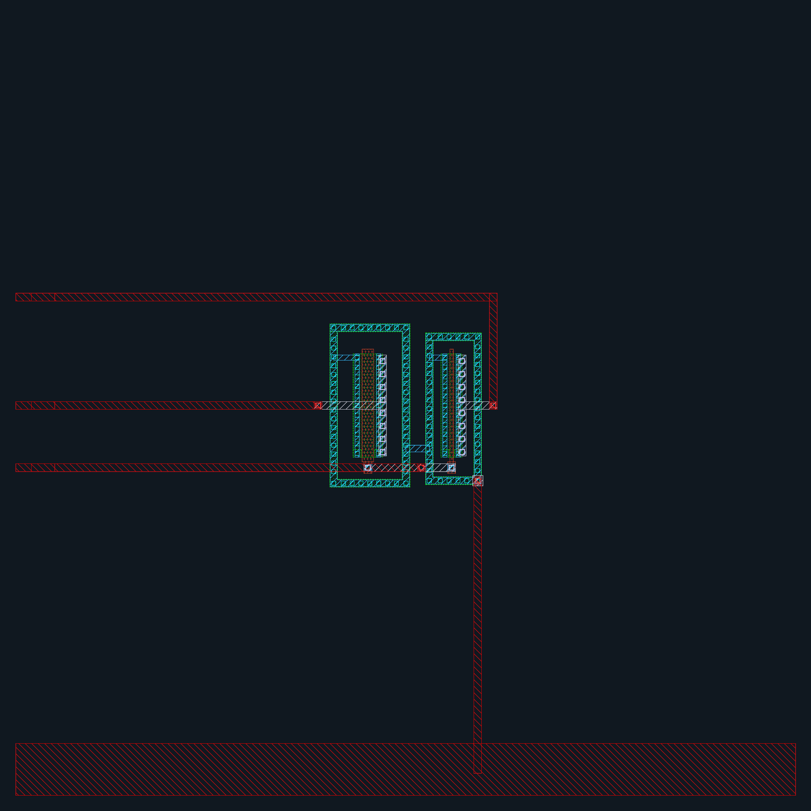{width=5.10in}

Actual GDS view: 30.00 × 30.00 µm bounding box; +x right, +y up. Source: `designs/g1-guardian/blocks/g1_dose/layout/g1_dose_macro.gds`. This is the block delivery before any chip assembly transformations. The display shows selected physical layers; hidden fill, well and recognition layers remain in the source GDS. See the chip-view legend and layout manifest for rendering scope.

```{=openxml}
<w:p><w:r><w:br w:type="page"/></w:r></w:p>
```

## DOSE: baseline leakage versus temperature

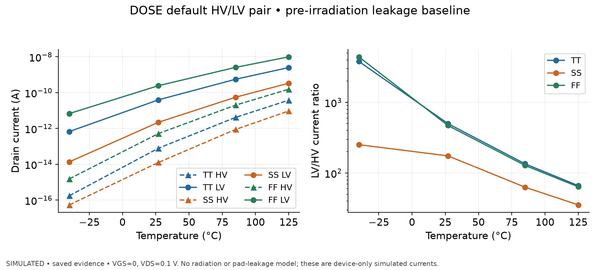{width=6.20in}

**Simulated, saved evidence.** Pre-irradiation, device-only simulated leakage of the default HV/LV pair at VGS=0 and VDS=0.1 V for TT/SS/FF, with temperature limited to −40…125 °C. The legacy D_ELT terminal is the HV device in this default variant. The PDK has no radiation damage model; this is not leakage-versus-dose characterization.

At 27 °C TT the HV current is 7.92e−14 A and LV current 3.97e−11 A (ratio 501). The TT ratio changes from approximately 3800 at −40 °C to 66.3 at 125 °C, demonstrating that temperature cancellation cannot be assumed for this HV/LV pair. The fA/pA-level currents are device model outputs without pad/package leakage or instrument limitations. Physical measurements and post-layout/pad-leakage analysis remain **not run**.

Source data: `designs/g1-guardian/blocks/g1_dose/sim/results_variants.md`. Extracted plot data: `designs/g1-guardian/review/results/08_dose_leakage.csv`; input hashes and plotting command: `designs/g1-guardian/review/results/provenance.json`.

```{=openxml}
<w:p><w:r><w:br w:type="page"/></w:r></w:p>
```

# G1_DUT: single accessible SiGe HBT

Block root: `designs/g1-guardian/blocks/g1_dut/`.

One default `npn13G2`, Nx=1, 0.07 ×0.90 µm emitter, with B/C/E on separate analog pads and substrate tied to ground. Characterizes the device used in BGR/T2F. PDK PCell and substrate ring preserved; macro flattening retains emitter pin shapes and HBT identifying texts needed by the PDK recognition rules.

| Artifact | Repository-relative path |
| --- | --- |
| Circuit references (CDL; no dedicated xschem schematic found) | `designs/g1-guardian/blocks/g1_dut/schematic/g1_dut.cdl`, `designs/g1-guardian/blocks/g1_dut/schematic/g1_dut_macro.cdl` |
| Macro, 34 × 34 µm | `designs/g1-guardian/blocks/g1_dut/layout/g1_dut_macro.gds`, `designs/g1-guardian/blocks/g1_dut/layout/g1_dut_macro.lef` |
| Simulations | `designs/g1-guardian/blocks/g1_dut/sim/gen_decks.py`, `designs/g1-guardian/blocks/g1_dut/sim/results.md`, `designs/g1-guardian/blocks/g1_dut/sim/logs/` |

Gummel and output curves at three HBT corners × four characterized temperatures: 24 runs complete; additional 150,175,−196 °C cases extrapolated. TT 27 °C VBE is 665.4 mV at 1 µA, 726.6 mV at 10 µA; beta 678 and 754; delta-VBE(8:1) 55.24 mV vs ideal 53.78 mV. Seven runs contain singular-matrix warnings that gmin stepping recovered; measurements present. Filled macro DRC/LVS **passed**, checked `reports/drc_macro/drc_run_2026_09_19_11_09_03.log`, `reports/lvs_macro/lvs_run_2026_09_19_11_09_44.log`. PEX/post-layout, inverse-mode Gummel, separate self-heating validation **not run**. Mismatch matching claim **not applicable** for a single DUT. Pad leakage and route parasitics are outside block tests.

Reproduction: `G1_WORKDIR=designs/g1-guardian/blocks/g1_dut/sim flow/run.sh bash run_all.sh`.


```{=openxml}
<w:p><w:r><w:br w:type="page"/></w:r></w:p>
```

## G1_DUT: physical layout

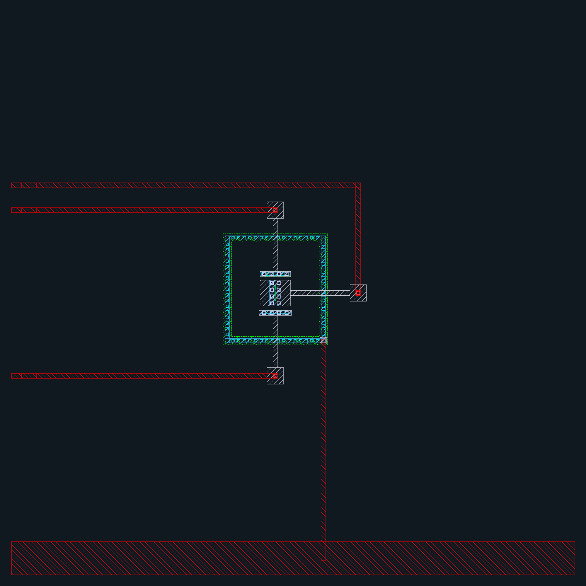{width=5.10in}

Actual GDS view: 34.00 × 34.00 µm bounding box; +x right, +y up. Source: `designs/g1-guardian/blocks/g1_dut/layout/g1_dut_macro.gds`. This is the block delivery before any chip assembly transformations. The display shows selected physical layers; hidden fill, well and recognition layers remain in the source GDS. See the chip-view legend and layout manifest for rendering scope.

```{=openxml}
<w:p><w:r><w:br w:type="page"/></w:r></w:p>
```

## DUT: HBT Gummel and current-gain sweeps

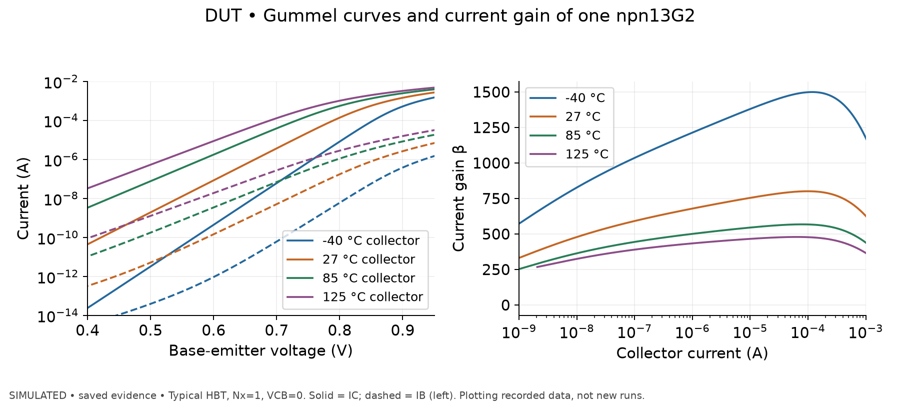{width=6.20in}

**Simulated, saved evidence.** Actual saved Gummel sweeps for one typical `npn13G2`, Nx=1, VCB=0, at −40, 27, 85 and 125 °C. Collector current is solid and base current dashed; the right panel plots the saved current gain against collector current. The temperature range is characterized, but the full voltage sweep includes low-bias model extrapolation below the documented VBE≈0.65 V validity region; the plot is characterization of the model, not a validated silicon prediction over every displayed point.

At 27 °C, VBE at 1/10 µA is 665.4/726.6 mV and current gain 678/754. At 1 µA, gain falls from 1213 at −40 °C to 433 at 125 °C. The strong temperature dependence helps explain why HBT base-current loading and comparator bias deserve explicit checks. No measured gain, cryogenic prediction or dose response is inferred.

Source data: `designs/g1-guardian/blocks/g1_dut/sim/decks/hbt_typ_Tm40C_gummel.dat`; `designs/g1-guardian/blocks/g1_dut/sim/decks/hbt_typ_Tp125C_gummel.dat`; `designs/g1-guardian/blocks/g1_dut/sim/decks/hbt_typ_Tp27C_gummel.dat`; `designs/g1-guardian/blocks/g1_dut/sim/decks/hbt_typ_Tp85C_gummel.dat`. Extracted plot data: `designs/g1-guardian/review/results/09_dut_gummel.csv`; input hashes and plotting command: `designs/g1-guardian/review/results/provenance.json`.

```{=openxml}
<w:p><w:r><w:br w:type="page"/></w:r></w:p>
```

# G1_SENSE

- Record: `designs/g1-guardian/blocks/g1_sense/README.md`.
- Schematics: `designs/g1-guardian/blocks/g1_sense/schematic/g1_sense.sch`, `schematic/g1_ota.sch` in that block. Generator `schematic/gen_sense.py`, netlisting `schematic/netlist.sh`.
- Simulation source: `designs/g1-guardian/blocks/g1_sense/sim/netlist/g1_sense.spice`; `sim/tb_sense.cir`, `sim/run_sense.sh`, `sim/results_sense.txt`, `sim/results_sense_mc_27C.txt`.
- Layout: `designs/g1-guardian/blocks/g1_sense/layout/g1_sense_filled.gds` is the block delivery before assembly transformations; bare `g1_sense.gds`, OTA `g1_ota.gds`, `g1_sense.lef`, `g1_sense.cdl` accompany it. Macro is 252.16 × 189.25 µm.
- PEX simulation: `designs/g1-guardian/blocks/g1_sense/sim/postlayout/g1_sense_pex.spice`; comparison `sim/postlayout/results/compare.md`; converter `sim/postlayout/make_pex_netlist.py`.

Revision B implements ISENSE = VPED + 20 × (SENSE_P − SENSE_N); VPED = (51/53) × VREF. VREF is 1.04 V nominal, buffered by a third OTA because the BGR's high source impedance cannot drive the two DAC strings. Bias is 4.13 µA IPTAT at 27 °C. PMOS input folded-cascode OTA plus PMOS second stage; 0.8 pF Miller compensation and 1.7 kΩ nulling resistor. The second stage was added after the single-stage loaded gain was only 9.5 rather than 20. Resistor array uses full-length units and LVS `--no_series_res` to avoid a series-combiner false assurance at input taps. Input pair and resistor network use symmetry/common-centroid layout with dummies/no-fill regions.

Evidence: schematic nominal gain 19.988, bandwidth 4.186 MHz, 10–90% step 78.8 ns. Current post-layout nominal gain 19.9868, bandwidth 4.186 MHz, rise 77.8 ns, overshoot 18.2 mV vs 5.4 mV schematic; true final ±1% settling 217.9 ns (first crossing 124 ns is not final settling). Post-layout comparisons span tt −40/27/175 °C and ff 27/ss 175 °C; 175 °C is model extrapolation. Filled DRC and LVS passed under `reports/drc_fill` and `reports/lvs_fill`; OTA and bare macro reports also exist.

Open: revision-A-only mismatch MC (198 usable values from 200) gave σ 4.00 mV shunt-referred and 3σ 12 mV: **failed untrimmed 0.5 mV target**. Digital signed threshold offset was selected to compensate; revision-B MC and temperature-dependent offset validation are **not run**. 3.6 V schematic AC/transient **failed convergence** (README calls resulting metrics not run); post-layout supply extremes, CM corners, MC, noise and wire resistance are **not run**. High-frequency supply rejection remains weak. The available evidence does not establish the physical cause of the convergence failure.

## G1_SENSE: physical layout

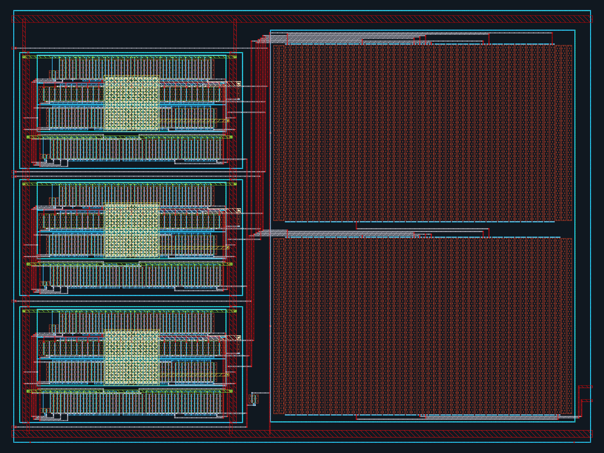{width=6.20in}

Actual GDS view: 252.16 × 189.25 µm bounding box; +x right, +y up. Source: `designs/g1-guardian/blocks/g1_sense/layout/g1_sense_filled.gds`. This is the block delivery before any chip assembly transformations. The display shows selected physical layers; hidden fill, well and recognition layers remain in the source GDS. See the chip-view legend and layout manifest for rendering scope.

```{=openxml}
<w:p><w:r><w:br w:type="page"/></w:r></w:p>
```

## SENSE: recorded dynamic-performance results

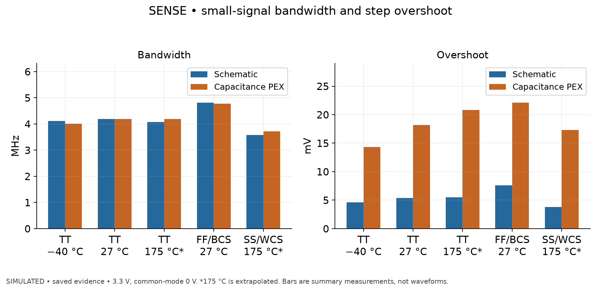{width=6.20in}

**Simulated, saved evidence.** Simulated small-signal −3 dB bandwidth and step overshoot, schematic versus C-PEX, for five saved matched cases at 3.3 V and common-mode 0 V. These bars are extracted scalar measurements, not reconstructed transient waveforms. Asterisks mark 175 °C model extrapolations.

Nominal bandwidth stays near 4.186 MHz, while overshoot increases from 5.4 to 18.2 mV. Nominal first crossing into the ±1% band is 124.0 ns post-layout, but final entry/stay-in-band is 217.9 ns. That distinction matters: first crossing alone overstates settling performance when overshoot leaves the band again. Across the plotted cases, post-layout overshoot is 14.3…22.1 mV. The dataset contains missing/nonconverged operating-point values for other quantities; those were not plotted as zero or assigned pass status.

Source data: `designs/g1-guardian/blocks/g1_sense/sim/postlayout/results/compare.md`. Extracted plot data: `designs/g1-guardian/review/results/05_sense_dynamics.csv`; input hashes and plotting command: `designs/g1-guardian/review/results/provenance.json`.

```{=openxml}
<w:p><w:r><w:br w:type="page"/></w:r></w:p>
```

# G1_TRIP

- Record: `designs/g1-guardian/blocks/g1_trip/README.md`, `INTERFACE.md`.
- Schematics: `designs/g1-guardian/blocks/g1_trip/schematic/g1_trip.sch`, `g1_cmp.sch`, `g1_dac8.sch`, `g1_cond.sch`, `g1_tlvlup.sch` and supporting gate cells in that directory.
- Frozen netlists: `designs/g1-guardian/blocks/g1_trip/sim/netlist/g1_trip.spice` and child `.spice` files.
- Layout: `designs/g1-guardian/blocks/g1_trip/layout/g1_trip.gds` (filled macro of record), `g1_trip.lef`, `g1_trip_lvs.cdl`; generator `gen_trip_layout.py`. Macro 229 × 207 µm.
- Simulation summaries: `designs/g1-guardian/blocks/g1_trip/sim/results_cmp_delay.txt`, `results_cmp_mc_cm0.75.txt`, `results_dac.txt`, `results_dac_mc.txt`, `results_kickback.txt`; runner `sim/run_trip.sh`.
- Post-layout: `designs/g1-guardian/blocks/g1_trip/sim/postlayout/g1_trip_pex.spice`, `results_postlayout.txt`, `results_postlayout_rev1.txt`, `pex_summary.txt`; runner `run_postlayout.sh`.

Two StrongARM comparators, strobed on opposite cmp_clk edges, compare ISENSE/2 against two independently coded 8-bit DACs; SR latches hold decisions. Each DAC has 530 resistor units, 510 thick-oxide NMOS tree switches and 8 level shifters. VDAC = VREF × (255 + code)/530, about 1.962 mV comparator-referred or 0.1962 mV shunt-referred per LSB. Thick-oxide switches and increased string current replaced LV transmission gates after leakage caused 8 LSB nominal/53 LSB hot tap errors. Three 1 pF hold capacitors absorb kickback. Two comparator neutralisation dummies are functional devices; they must not be mistaken for removable density fill.

Post-layout symmetry revision was necessary: first layout had >8 mV offset; symmetric routing reduced comparator internal drain capacitance imbalance. Current block PEX comparator tt 1 mV delay 0.856 ns and ss/1.08 V/−40 °C 1.778 ns, inside the 2 ns interface assumption for those tests; both decisions correct. Full 256-code soft DAC nominal PEX sweep: INL/DNL ≤0.002 LSB; settling 72.8/190.4 ns for 0→255/255→0. Comparator MC: 104 samples σ4.55 mV comparator-referred; DAC-string MC: 100 samples INL ≤0.22 LSB. Filled DRC, hierarchical LVS, standalone DAC no-series LVS, antenna and LEF evidence passed in `reports/`.

Caution: broad README 'schematic nominal passed' coexists with real kickback failure at 49.8 mV shunt (hard output 1, expected 0) in `sim/results_kickback.txt` and README table. Post-layout comparator test uses 5 MHz strobe; 10 MHz first-version tests had residual kickback and failed 1 mV decisions on schematic too. PEX with real G1_SENSE kickback source, post-layout MC/noise/metastability, chip-context small-overdrive coverage are **not run**. TRIP_SET override is **not built**. RC, fill coupling, MIM plate parasitics and thick-oxide-region capacitance omitted from present extraction.

## G1_TRIP: physical layout

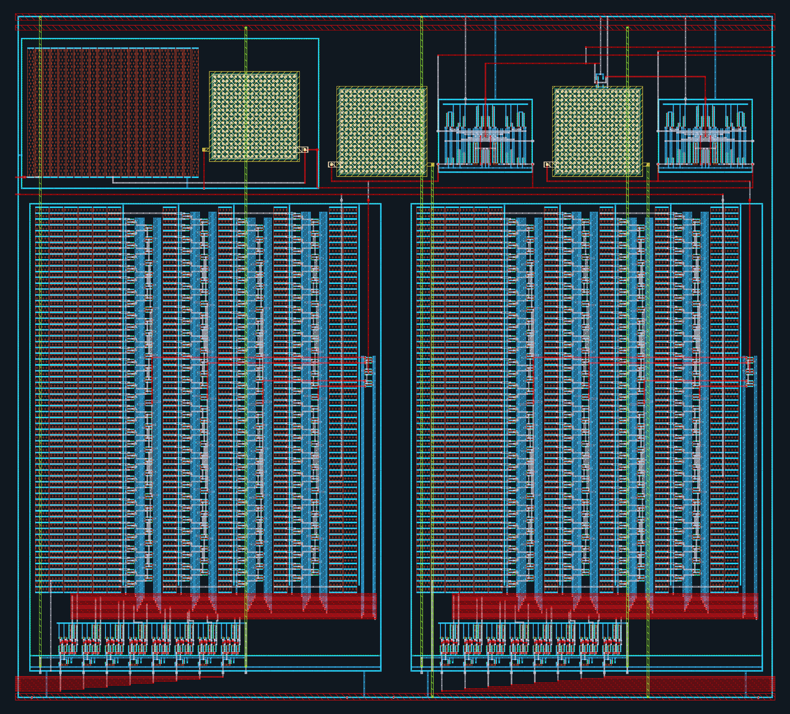{width=5.64in}

Actual GDS view: 229.00 × 207.00 µm bounding box; +x right, +y up. Source: `designs/g1-guardian/blocks/g1_trip/layout/g1_trip.gds`. This is the block delivery before any chip assembly transformations. The display shows selected physical layers; hidden fill, well and recognition layers remain in the source GDS. See the chip-view legend and layout manifest for rendering scope.

```{=openxml}
<w:p><w:r><w:br w:type="page"/></w:r></w:p>
```

## TRIP: comparator delay versus overdrive

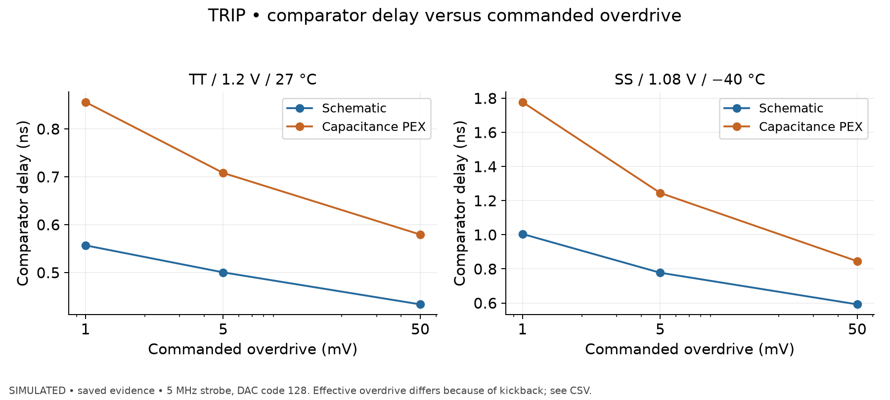{width=6.20in}

**Simulated, saved evidence.** Simulated comparator delay against commanded overdrive at 5 MHz strobe, DAC code 128, for TT/1.2 V/27 °C and SS/1.08 V/−40 °C. Effective overdrive at the measured event differs from the commanded input because of settling and kickback; both values are preserved in the plot CSV.

At commanded 1 mV, delay changes 0.5568→0.8560 ns nominal and 1.0044→1.7776 ns at SS/cold/low-VDD. Corresponding PEX effective overdrives are only 0.2025 and 0.3968 mV. At commanded 50 mV the nominal delay is 0.4336→0.5794 ns. These are comparator event delays, not full shunt-to-external-GATE trip latency. Neither a sub-nanosecond comparator result nor these selected cases prove system sign-off.

Source data: `designs/g1-guardian/blocks/g1_trip/sim/postlayout/results_postlayout.txt`. Extracted plot data: `designs/g1-guardian/review/results/06_trip_delay.csv`; input hashes and plotting command: `designs/g1-guardian/review/results/provenance.json`.

```{=openxml}
<w:p><w:r><w:br w:type="page"/></w:r></w:p>
```

# G1_GATE

- Record: `designs/g1-guardian/blocks/g1_gate/README.md`.
- Schematics/netlist: `designs/g1-guardian/blocks/g1_gate/schematic/g1_gate.sch`, `g1_lvlup.sch`, `g1_lvldn.sch` and gate cells; `designs/g1-guardian/blocks/g1_gate/sim/netlist/g1_gate.spice`.
- Layout: `designs/g1-guardian/blocks/g1_gate/layout/g1_gate_filled.gds`, bare `g1_gate.gds`, `g1_gate.lef`, `g1_gate.cdl`.
- Summaries: `designs/g1-guardian/blocks/g1_gate/sim/results_gate.txt`, `results_gate_pwr.txt`, `postlayout/results_postlayout.txt`; extracted netlist `sim/postlayout/g1_gate_pex.spice`.

Asynchronous trip latch and level shifters bridge 1.2 V control and 3.3 V IO. Reset (!EN or clear) wins set; optional fast comparator path bypasses digital filtering. Pad model carries actual drive; external FET represented by 5 nF + 10 Ω. Nominal fast-path core delay increases 1.52→2.68 ns with block PEX; digital-trip core 2.84→3.68 ns. Pad-dominated fall remains 606 ns; hard_cmp→GATE<1 V 378→380 ns. Filled DRC/LVS passed, 78 MOS. Slow hot pad-free logic and fast cold pad-free logic passed, but pad-inclusive corner transients failed numerical convergence. Post-layout power-up **not run**.

Critical functional constraint: schematic power sequencing simulation found GATE reaches 3.30 V with EN low when IOVDD rises before VDD; 10 kΩ pull-down still reaches 3.29 V. The nominal low gate_core does not guarantee the IO cell output state without its core rail. VDD-first with pull-down kept GATE low; VDD-first without pull-down failed numerical convergence. This is an unresolved system safety/board-sequencing constraint, not an all-power-up-pass result. No real FET model, charge-injection latch upset or physical measurement evidence.

```{=openxml}
<w:p><w:r><w:br w:type="page"/></w:r></w:p>
```

## G1_GATE: physical layout

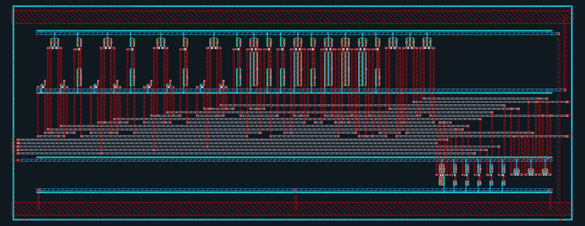{width=6.20in}

Actual GDS view: 130.68 × 50.65 µm bounding box; +x right, +y up. Source: `designs/g1-guardian/blocks/g1_gate/layout/g1_gate_filled.gds`. This is the block delivery before any chip assembly transformations. The display shows selected physical layers; hidden fill, well and recognition layers remain in the source GDS. See the chip-view legend and layout manifest for rendering scope.

```{=openxml}
<w:p><w:r><w:br w:type="page"/></w:r></w:p>
```

## GATE: core and loaded output timing

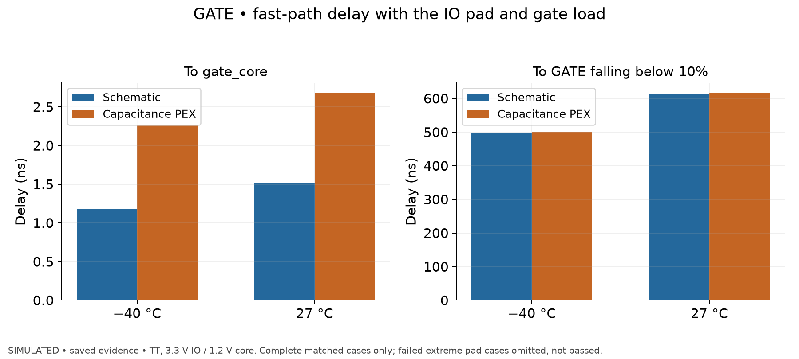{width=6.20in}

**Simulated, saved evidence.** Saved matched full-pad fast-path cases at nominal MOS, 3.3 V IO/1.2 V core, −40 and 27 °C. Left: hard comparator input to internal gate_core. Right: the same trigger to external GATE falling below 10% of its supply. No-pad fallbacks and failed extreme-pad cases are excluded rather than presented as passed.

At 27 °C the internal delay increases 1.516→2.677 ns, whereas the external 10% crossing changes 614.514→615.552 ns. At −40 °C it is 498.194→499.319 ns externally. Most of the external fall time is therefore in the pad/load path for these cases. This is not a newly simulated waveform and does not establish startup or extreme-PVT completion; the retained fast-corner pad PEX test aborts at 4.30135 µs before later measurements.

Source data: `designs/g1-guardian/blocks/g1_gate/sim/postlayout/results_postlayout.txt`; `designs/g1-guardian/blocks/g1_gate/sim/results_gate.txt`. Extracted plot data: `designs/g1-guardian/review/results/07_gate_delay.csv`; input hashes and plotting command: `designs/g1-guardian/review/results/provenance.json`.

```{=openxml}
<w:p><w:r><w:br w:type="page"/></w:r></w:p>
```

# G1_TOP

Simulation harness, **not a physical macro**; physical assembly belongs to PADRING.

- `designs/g1-guardian/blocks/g1_top/sim/run_top.py`, `sim/rtl/g1_dig_cosim.v`, `sim/decks/`, `sim/logs/`, `sim/results/waves/`, `sim/results/summary.md`, `sim/bridge_probe/README.md`.
- Scope: BGR/SENSE/TRIP/GATE transistor-level blocks + actual RTL; ideal clock at block simulated frequency; fitted output drivers; detailed analog pads; behavioural board load/shunt/FET. PEX substitutes block capacitance models, **not full-chip routing, gate-level RTL or package parasitics**.
- Current corrected `_clockfix` evidence: 8 schematic cases and 3 behavioural long-window cases completed. Normal hard trip GATE<0.33 V 1.75596 µs after event; fast 0.84921 µs. Long-window behavioural soft trip digital latch 1007.41 µs, GATE<0.33 V about 1008.02 µs. Short pulse/burst cases finish untripped; rearm test restores nominal current.
- Historical unsuffixed clock bridge delivered double posedges on 0→X→1 and timing is invalid. README status table is stale relative to completed corrected logs; use generated summary and corrected logs.
- Stopped c_pex and gA power-up have no transient progress timestamp/waveform/footer: **not run to completion**, cannot classify functional success/failure. gA was schematic GATE/detailed pads/behavioural front end, not post-layout.
- Hot c/e numerical failures are real but different cases: near 30.020/30.066 µs, timestep 6.25e−21, trouble node vm_tripd#branch in actual logs. Full chip PEX, process/mismatch and completed integrated power-up are **not run**.

{width=6.3in}

Toolchain of these records: ngspice 46, Icarus 14, KLayout 0.30.9 and kpex 0.3.12; PDK 84374023ee8b4b126bebbba67fcbada0a9c0ff0b. Reproduction runners use `G1_WORKDIR=<block>/sim flow/run.sh ...`; exact per-run model/hash headers survive in logs.


```{=openxml}
<w:p><w:r><w:br w:type="page"/></w:r></w:p>
```

## System simulation: long-window soft trip

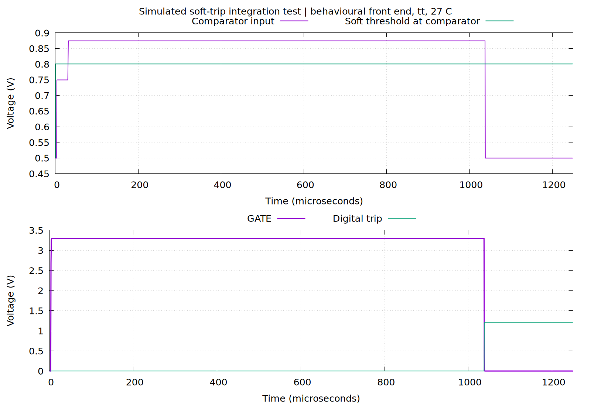{width=6.20in}

**Simulated:** corrected `b_sch_beh_tt_27C_clockfix`, typical models, 27 °C, behavioural front end and actual RTL. The sustained over-threshold condition eventually triggers the programmed digital delay and turns GATE off. This long-window behavioural result does not certify transistor-level or post-layout behavior. Source: `designs/g1-guardian/blocks/g1_top/sim/results/waves/b_sch_beh_tt_27C_clockfix.txt`. The time axis is absolute; the load step begins at 30 µs.

```{=openxml}
<w:p><w:r><w:br w:type="page"/></w:r></w:p>
```

## System simulation: hard trip, disable and re-arm

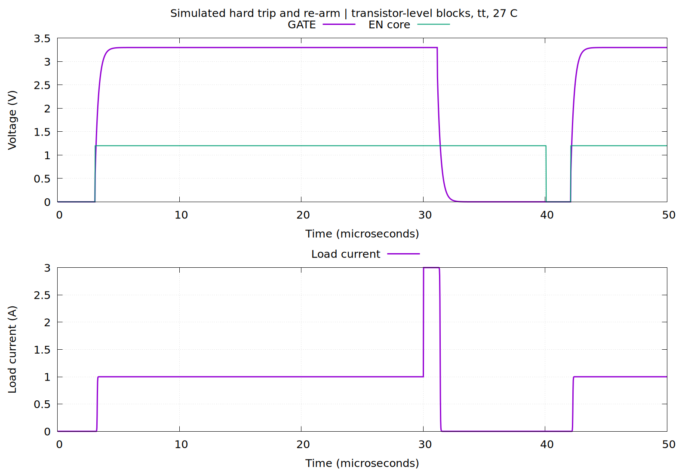{width=6.20in}

**Simulated:** corrected `f_sch_tl_tt_27C_clockfix`, typical transistor-level blocks, ideal clock and fitted pad driver, 27 °C. The hard event trips the gate; toggling EN permits re-arm and restores approximately 1 A load current. Source: `designs/g1-guardian/blocks/g1_top/sim/results/waves/f_sch_tl_tt_27C_clockfix.txt`. Plot reproduction: `flow/run.sh gnuplot designs/g1-guardian/review/results/top_evidence.gp`.

```{=openxml}
<w:p><w:r><w:br w:type="page"/></w:r></w:p>
```

# Built against and assembly identification

Design: G1 radiation-aware node guardian, low-side external-NMOS breaker, temperature frequency telemetry, NMOS dose coupons and scrubbed SEU monitor. Current die is 1350 × 1350 µm, QFN24, 622 × 622 µm core window, 12 macro instances. Earlier 1 mm and 1.2 mm floorplans are obsolete: the first cannot accommodate PDK IO/bondpad/sealring geometry, the second offers 0.223 mm² core against 0.274 mm² macro footprint. Engineering decision record: `designs/g1-guardian/PLAN.md`; geometry: `designs/g1-guardian/padframe/README.md`.

Recorded toolchain in PLAN.md: public IHP SG13G2 commit `84374023ee8b4b126bebbba67fcbada0a9c0ff0b` (PDK COMMIT file); ngspice 46, KLayout 0.30.9, xschem 3.4.8RC, LibreLane 3.1.0.dev2, Yosys 0.67, OpenROAD 26Q3-850, Icarus Verilog 14.0 (version flags recorded as provenance). Container identifier recorded as digest `sha256:5fd78498e578c6e9ec10828c248ca3790fc88250ff6caf545521b29e448ea3c0` by docker inspect. kpex 0.3.12 is established in block extraction records; CACE is recorded as present without an exact version. Availability alone does not establish an exact version. `flow/run.sh` actually defaults to mutable `tapeoutbench-eda:latest` and forces linux/amd64; future reproduction should verify image identity. README's xschem 'not yet run' is stale relative to PLAN and schematic generators.

Final assembly GDS: `designs/g1-guardian/blocks/g1_padring/flow/runs/assembly-1350/final/gds/g1_chip_top.gds` (local build output); recorded SHA-256 `38c1d6d13bbfee4ed0e3c01477742c3d2d28317d9215d9e5bd9a35551285ae59` in `designs/g1-guardian/blocks/g1_padring/reports/assembly-1350/final_gds.sha256`. Netlists: `designs/g1-guardian/blocks/g1_padring/netlist/g1_chip_top.cdl`, `g1_chip_top.pnl.v`, `g1_chip_top.nl.v`. Main integration wrapper: `designs/g1-guardian/blocks/g1_padring/rtl/g1_core_dryrun.sv`; chip/pad connectivity: adjacent `g1_chip_top.sv`. Full run entrypoint is `flow/run_dryrun.sh`.

# G1_CTRL and G1_SEU

Source directory: `designs/g1-guardian/blocks/g1_ctrl/rtl/`. `g1_digital.v` wraps `g1_digital_top.v`; `g1_serial.v` implements the 3-wire serial interface, `g1_regfile.v` holds map 1.1, other RTL implements trip logic. SEU implementation is in `designs/g1-guardian/blocks/g1_seu/rtl/`. There is no separate transistor schematic for the synthesized controller: RTL is the source, generated standard-cell netlists are the implementation. Contract: `designs/g1-guardian/specification/G1_REGISTER_MAP.md`.

Design choices: serial shift logic runs on SCLK, with toggle/level synchronizers to the uncalibrated oscillator domain, 24-clock read frame and idle-timeout framing (no chip-select pin); supported f_SCLK ≤ f_OSC. EN/reset asynchronously assert and synchronously release. Comparator clock is OSC/2, not OSC; HARD_N counts comparator decisions. Reset soft/hard codes 0x99/0xFE. Programmable soft up/down accumulation is an I²t-like discriminator, not a measurement of current squared. FAST_EN permits comparator-to-analog-latch action while digital logic observes and counts the event. See register contract for exact timing and programming.

Built SEU depth: 256 plain stages and 3 × 128 TMR stages (640 chain flops). Larger 1024/256 and 512/256 do not fit; 512/128 failed placement. Keep attributes prevent synthesis merging redundant flops. Constant/checkerboard patterns exercise data without per-stage enable mux area. TMR placement is run7: copies spread around each stage centroid, 199 chain/control stages, 597 redundant flops, minimum separation 27.4 µm and median 42.6 µm. This is geometry evidence, not measured radiation hardness; voters and clock tree remain common failure paths. Unit tests still use 1024/256, while integrated RTL and GLS cover built 256/128.

Views of record: `designs/g1-guardian/blocks/g1_ctrl/layout/g1_digital.gds`, `g1_digital.lef`, `g1_digital.nl.v`, `g1_digital.pnl.v`, `g1_digital.nom.spef`, `lib/`, `SHA256SUMS`; pin/constraints documentation `PINS.md`, `TOP_SDC.md`, `g1_digital_top.sdc`. Macro 360 × 360 µm, 46 signal pins. run7 cell area 95149 µm²/81.4% utilization; 4842 stdcells after repair, 2 antenna diode cells. Vectorless estimated power 0.97 mW at typ/10 MHz, not measured.

| Check | Status | Existing evidence |
| --- | --- | --- |
| RTL integrated controller + SEU, map 1.1 | passed: 15 tests, 204 checks, 0 errors (raw log verified) | `designs/g1-guardian/blocks/g1_ctrl/sim/tb_g1_digital.log` |
| SEU unit RTL 1024/256 | passed: 11 tests, 43 checks (README/log reference) | `designs/g1-guardian/blocks/g1_seu/sim/tb_g1_seu.log` |
| run7 functional gate-level | passed: 13 tests, 193 checks, 0 errors (raw log verified) | `designs/g1-guardian/blocks/g1_ctrl/sim/tb_g1_digital_gls_run7.log` |
| SDF-annotated dynamic gate-level | not run; GLS uses functional library + unit delay, skips RTL-internal T11/T12 probes | `designs/g1-guardian/blocks/g1_ctrl/sim/run_gls.sh` |
| Macro DRC, LVS, streamout XOR, antenna | passed, KLayout DRC total 0 and netgen unique match verified | `designs/g1-guardian/blocks/g1_ctrl/reports/librelane_run7/` |
| Parasitic STA | passed fast/typ/slow, hold +0.106/+0.185/+0.326 ns; setup +29.06/+28.84/+28.48 ns; zero slew/cap violations | same directory `sta_summary.rpt`, `sta_checks_*.rpt`, `metrics.json` |
| TMR ≥20 µm | passed, 199/199 stages; raw separation report verified | same directory `tmr_separation.txt` |
| Max fanout | not run (automatic check): flow has no checker; 78 CTS leaf buffers exceed default 10-sink reporting threshold, 16–17 sinks, slew passes | same directory metrics, controller README |
| Irradiation, SEU cross-section, voter upset tolerance | not run | `designs/g1-guardian/blocks/g1_seu/README.md` |

Reproduction: `flow/run.sh bash designs/g1-guardian/blocks/g1_ctrl/sim/run_sim.sh`; `flow/run.sh bash designs/g1-guardian/blocks/g1_ctrl/sim/run_gls.sh [netlist] [tag]`. Hardening config: `designs/g1-guardian/blocks/g1_ctrl/flow/config_tmr_spread.yaml` and `tmr_spread.py`. Historical runs 4/6 have slew failures; they are not current implementation.

```{=openxml}
<w:p><w:r><w:br w:type="page"/></w:r></w:p>
```

## G1_CTRL + G1_SEU: physical layout

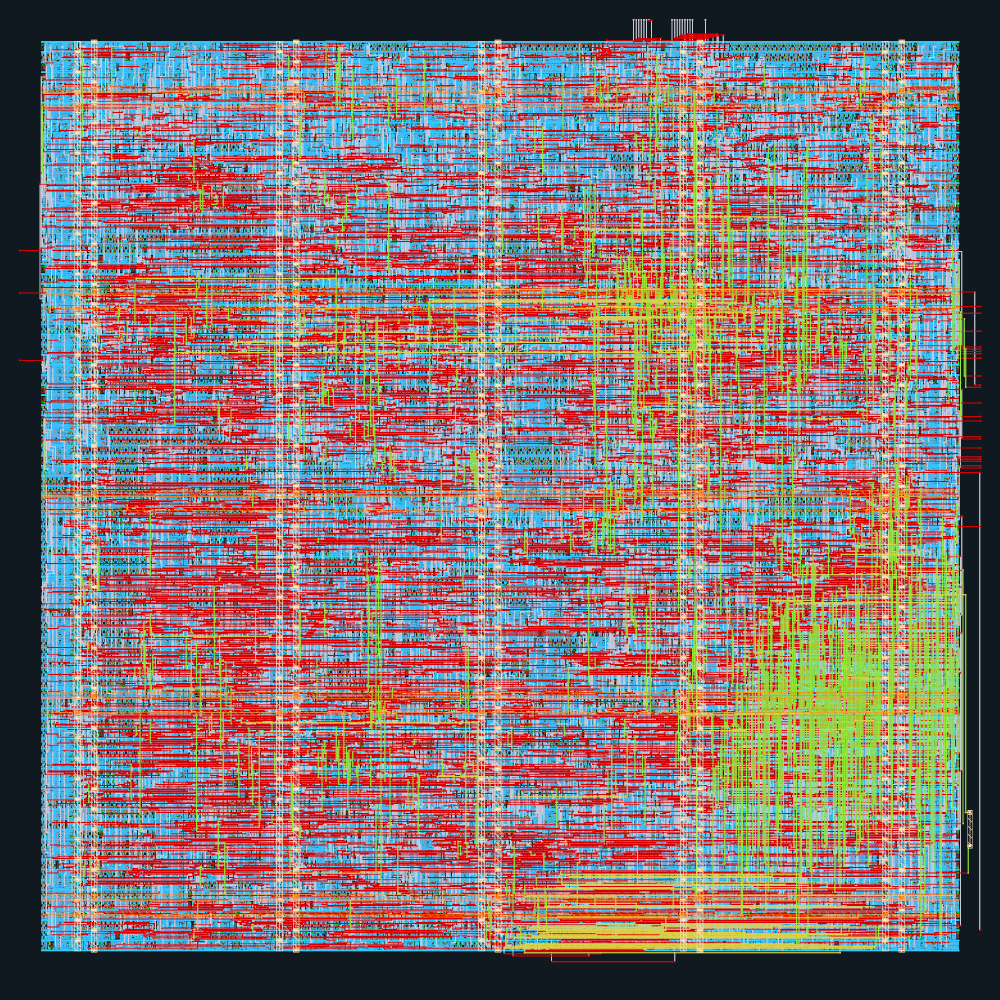{width=5.10in}

Actual GDS view: 360.00 × 360.00 µm bounding box; +x right, +y up. Source: `designs/g1-guardian/blocks/g1_ctrl/layout/g1_digital.gds`. This is the block delivery before any chip assembly transformations. The display shows selected physical layers; hidden fill, well and recognition layers remain in the source GDS. See the chip-view legend and layout manifest for rendering scope.

```{=openxml}
<w:p><w:r><w:br w:type="page"/></w:r></w:p>
```

# Internal level shifters

Three g1_ls_up instances convert t2f_en, t2f_mode, bgr_r4 from 1.2 V to VDDA 3.3 V. Eight-MOS cross-coupled topology adapted structurally from public PDK IO level-up cell; pull-down enlarged to 3.8 µm for worst supply/keeper contention. Static controls only. GATE has its own internal translators.

Source: `designs/g1-guardian/blocks/g1_ctrl/ls/xschem/g1_ls_up.sch`; SPICE/CDL `designs/g1-guardian/blocks/g1_ctrl/ls/sim/netlist/g1_ls_up.spice`, `g1_ls_up.cdl`; layout `designs/g1-guardian/blocks/g1_ctrl/ls/layout/g1_ls_up.gds`, `.lef`, generator `.py` (9.2 × 11.7 µm). Reports `designs/g1-guardian/blocks/g1_ctrl/ls/reports/`.

Schematic simulation passed: 81 process/supply/temperature points (tt/ff/ss, VDD 1.08/1.20/1.32, VDDA 2.97/3.30/3.63 V, −40/27/175°C), 20 fF output. Simulated rise/fall delays nominal 630/789 ps, worst 1067/1393 ps, full swing. Six power-up order/process cases passed with input low during ramp. Results: `designs/g1-guardian/blocks/g1_ctrl/ls/sim/results_ls.txt`. DRC full rule set and strict-port LVS passed. PEX/post-layout, mismatch MC and −196°C extrapolation: **not run**. Real analog loads have not replaced the 20 fF fixture. Thus do not say every block has post-layout verification.

```{=openxml}
<w:p><w:r><w:br w:type="page"/></w:r></w:p>
```

## G1 internal up-level shifter: physical layout

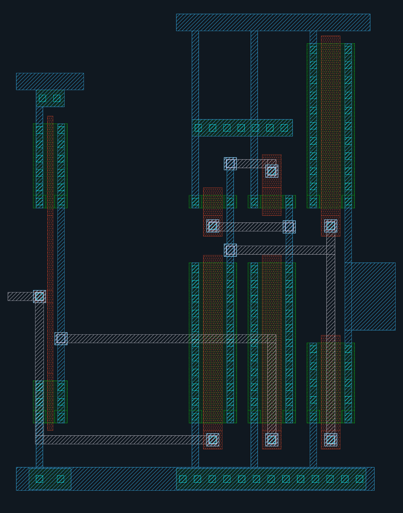{width=4.01in}

Actual GDS view: 9.20 × 11.70 µm bounding box; +x right, +y up. Source: `designs/g1-guardian/blocks/g1_ctrl/ls/layout/g1_ls_up.gds`. This is the block delivery before any chip assembly transformations. The display shows selected physical layers; hidden fill, well and recognition layers remain in the source GDS. See the chip-view legend and layout manifest for rendering scope.

```{=openxml}
<w:p><w:r><w:br w:type="page"/></w:r></w:p>
```

# Assembly and padframe

Current floorplan differs from old dryrun table: digital lower-left moved to (367,408) µm; DOSE macro 30 ×30 at (367,370), DUT 34 ×34 at (367,800). Remaining macro floorplan and supply routing are in `designs/g1-guardian/blocks/g1_padring/INTEGRATION.md`. 24 PDK IO cells, four corners, 92 fillers and separate 70 ×70 µm bondpads; 112 µm pad pitch. Core occupancy ~0.274/0.387 mm², 71%. QFN24 4×4 mm, 0.5 mm lead pitch, assumed conductive die attach/paddle connection. Packaging acceptance **not run**.

Three core supplies: VDD 1.2 V, VDDA 3.3 V, VSS common ground. IOVDD/IOVSS supply ring. A direct IOVDD core tap crossed existing pad rails; D14 uses analog pad 7 bare terminal as VDDA, with custom mesh/feed/vias. Board must tie VDDA and IOVDD to one 3.3 V rail, and apply VDD before or with IOVDD: pad-only simulation found GATE high with IOVDD alone. Actual OSC is on VDD **1.2 V**, explicitly in `g1_core_dryrun.sv`; several older summaries say 3.3 V incorrectly. Engineering hand estimate VDDA feed-to-farthest load 11–21 Ω and ~32 mV at 1.5 mA, not extracted or measured.

Pin map (source `designs/g1-guardian/specification/G1_TOP_LEVEL_SPECIFICATION.md`, section 3):

| Pin | Signal | Pin | Signal | Pin | Signal | Pin | Signal |
| --- | --- | --- | --- | --- | --- | --- | --- |
| 1 | VDD | 7 | VDDA | 13 | TRIP_SET | 19 | G_SHARED |
| 2 | VSS | 8 | SENSE_P | 14 | SCLK | 20 | D_STD |
| 3 | IOVDD | 9 | SENSE_N | 15 | SDI | 21 | D_ELT |
| 4 | IOVSS | 10 | GATE | 16 | SDO | 22 | HBT_E |
| 5 | VSS | 11 | FAULT_N | 17 | TEMP_OUT | 23 | HBT_B |
| 6 | IOVSS | 12 | EN | 18 | VREF | 24 | HBT_C |

TRIP_SET pin is present but **has no core consumer**; external override is not implemented. D_ELT names the second canary drain even when thick-oxide baseline is selected. VREF and TRIP_SET use series-protected padres; Kelvin/device/VDDA analog pins use padbare.

Important fill provenance: current config uses `designs/g1-guardian/blocks/g1_padring/flow/macro_gds_assembly/` derived GDS. `prepare_macros.py` removes macro drawing-boundary datatype 189/0 and selectively upper-metal fill to permit chip PDN routing. Existing log removed 120 SENSE, 55 TRIP, 20 GATE, 16 OSC fill cells on M4/M5/TM1/TM2; adds no-fill regions. These are assembly geometry transformations with DRC/density evidence, **not a validated electrical PEX reduction**. Block PEX and assembled fill geometry must be distinguished. Old `macro_gds_workaround/` mention in INTEGRATION.md is stale.

# Sign-off evidence and open failures

All evidence paths in table are under `designs/g1-guardian/blocks/g1_padring/reports/assembly-1350/`.

| Check | Status | Scope / evidence |
| --- | --- | --- |
| KLayout hard-rule DRC | passed: 0 | `drc.klayout.json`, deep/no_recommended |
| Hard-rule precheck DRC | passed: 0 | `drc_precheck/`; precheck skips some checks, not stronger than full deck |
| Density | passed: 0 windows | `density.klayout.json`, `density_detail/`; full die 1,822,500 µm² |
| Recommended-rule DRC | failed: 60 | `drc_recommended/`; Pad.fR_TM1 24, Pad.fR_TM2 36, stub recommendation; no waiver |
| KLayout antenna | failed: 9 | `antenna.klayout.json`: 3 each Metal5/TM1/TM2 on three input-pad receivers; reference-cell explanation does not close finding |
| OpenROAD routing/antenna | passed: 0 routing DRC, 0/0 antenna | `openroad-detailedrouting.log`, metrics; does not supersede KLayout antenna |
| STA | passed within digital constraints | `stapostpnr_summary.rpt`, `sta_*_min.rpt`; analog dynamics not covered |
| Supply connectivity/isolation | passed | `analog_straps.log`, `pdn_net_overlap.log`, `pdn_macro_overlap.log`, `supply_isolation.log`; 22 separately labeled conductors |
| Disconnected pins | passed critical check: 0 critical; 11 noncritical | `full_disconnected_pins_table.txt`; TRIP_SET no consumer remains |
| Core-only KLayout LVS | passed: **52 matched circuit pairs**, strict 19 top ports | `core_lvs/xref.txt`, `core_lvs/README.md`; completed 2026-09-19, recovered 2026-09-20, no new LVS run |
| Full-chip IO-inclusive LVS | failed | `lvs.netgen.rpt` and `../lvs_reference/`; netgen 42 errors; IO cell/deck mismatches unresolved |
| Magic DRC | failed: 675 | `drc.magic.rpt`; 524 pad/library/abutment and 151 core; not prescribed primary sign-off deck |
| Magic vs KLayout GDS XOR | failed: 30,632 differences | `klayout-xor.log`; macro-view differences explained, but not zero; KLayout primary streamout |
| Full-chip PEX, package/bondwire extraction | not run | no completed full-chip electrical extraction evidence |
| EM/IR full-chip sign-off incl. realistic analog activity | not run | geometric connectivity and hand estimates do not establish it |
| Formal CDC/reset sign-off | not run | synchronizer design/RTL tests and STA false paths are not formal CDC coverage |
| Fabrication, measurement, irradiation | not run | measurement plan only |
| Final packaging acceptance/submission approval | not run | no signed-off submission |

Core LVS exclusions: all 24 IO cells, ESD devices/internal joins, bondpads, fillers/corners and ring rails removed; top ports land on core-side pad terminals. It verifies integrated core connectivity and circuitry, not full-chip pad circuitry. Geometric continuity checks supplement it but are not transistor-level ESD/LVS. Earlier r1 passed DRC/STA yet shorted VDD/VDDA/VSS through custom straps; core LVS caught it. r2 fixes are in `analog_straps.tcl` and are supported by zero-overlap and strict core LVS evidence. Preserved stale-CDL failed LVS log is superseded by the passing refreshed-CDL log; preserve distinction.

Measurement document `designs/g1-guardian/measurement/README.md`: **all not run**. Planned socketed board with external FET/shunt, leakage/power-up, reference/serial, load-step trip/retry, HBT Gummel/output keeping VCE ≤1.6 V, canary leakage and irradiation, temperature soaks, SEU beam tests. Instruments and samples will need identification when results exist; current values must remain labeled simulated. Pad leakage subtraction is necessary to distinguish very low baseline canary current. Package extreme-temperature suitability is unverified.


# Extraction scope and evidence limitations

The integrated PEX test substitutes extracted block netlists; it does not contain full-chip interconnect RC, package/bond-wire parasitics, or a transistor-level digital macro. The current analog extraction is chiefly kpex 2.5D capacitance mode. Block-specific MIM restoration, omitted layers, well treatment and wire-resistance estimates are described in block records and must accompany any acceptance claim. Full RC extraction is not validated.

Floating density fill is already excluded from these electrical models. This does not prove that near-signal fill coupling is negligible. Manufacturing fill and matching/neutralisation dummy devices are different structures. Some assembly GDS copies have upper-metal fill removed for PDN clearance; these transformations are not validated electrical simplifications.

## Current model inventory

All four assembled ngspice files are flat single-block subcircuits. C totals are sums of listed instance values (not sum over both terminals, and not intentional cmim/device internal capacitances).

| Block | File bytes | Explicit C lines | Unique unordered pairs | Sum listed C (pF) | Explicit layout MOS / resistor calls |
|---|---:|---:|---:|---:|---:|
| BGR |15069|329|276|0.399746|28 /36 plus HBT and other devices|
| SENSE |79198|941|850|2.331023|517 /98|
| TRIP |664782|18329|17007|5.748108|1242 /1080|
| GATE |22270|554|508|0.409345|78 /0|

TRIP is 90.95% of 20,153 C lines and 85.1% of 781,319 bytes. Files are not large on disk; instance/topology/timestep cost matters. The 18329→17007 difference is pair aggregation; `pex_summary.py` labels unique pair count as 'entries', misleadingly. One TRIP C connects vss to itself, 325.768 fF: it has no voltage or electrical effect; exclude it for effective total 5.422340 pF. Other current files have no self-pairs. No capacitor-only node was found after collecting explicit MOS, resistor and other device terminals/top ports, so there is no evidence for thousands of isolated fill-node unknowns. Model-internal ngspice nodes are additional and uncounted here.

| TRIP threshold (strictly less) | C instance count | Fraction of listed C sum |
|---|---:|---:|
|0.001 fF|3853|0.02387%|
|0.01 fF|6568|0.19169%|
|0.1 fF|13151|5.66572%|
|1 fF|18040|32.77217%|

These global fractions **do not justify pruning**: small capacitance can matter on high-impedance regenerative nodes. TRIP large non-supply totals are DAC gate-control buses n55/n87/n71/n39/n51 at roughly 217–218 fF; README identifies these as level-shifter outputs loading up to 34 switch gates. Comparator drains n1692/n1693 and n1699/n1700 carry 12.40–12.43 fF including 2.66–2.69 fF to clock. icmp 25.87 fF; vth_soft 11.87, vth_hard 13.73; clk 23.31 fF; compare outputs 19–24 fF. These latter sensitive nets are tiny by whole-file C percentage yet essential to decision symmetry/kickback/delay. The 1060 DAC string resistors and 1020 switch-tree NMOS explain dominant architecture; a complete geometric per-DAC cap allocation is **not run** because flattened names require explicit source/layout mapping.

Inventory discrepancies to retain visibly: GATE README says 555 capacitors/69 fF, current simulation file has 554/409.345 fF; SENSE README says 942/2.6 pF, current file 941/2.331023 pF. SENSE is reconciled: its raw total is 2.613366 pF; removing the 282.343 fF VSUBS–vss entry after substrate mapping gives 2.331023 pF. Same-node elimination explains count differences, but the GATE total discrepancy is not reconciled. The total remains an open provenance discrepancy. TRIP summary includes the self-cap twice in vss terminal total; it is not real vss loading.

## Model construction and fill scope

`designs/g1-guardian/blocks/g1_trip/layout/pex_input.py` explicitly removes fill 22/no-fill 23, NoMetFiller and outline layers from a **copy**. Its comments explain kpex only maps drawing/pin datatypes; preserving datatype 22 would not extract it. SENSE `reports/pex/cc_fill/capacitor_values_md5_filled_vs_unfilled.txt` contains matching hashes, consistent with README's 942 raw values unaffected by fill. Therefore removing distant density fill cannot speed the present netlists: it is already absent. This is also an accuracy gap for near-signal fill, not an optimization success.


SENSE extraction uses flattened layout with child pin-label cleanup, reintroduces Miller devices, retains plain-metal plate overlap without correct MIM dielectric. TRIP removes MIM/Vmim/TopVia1/TopMetal1/Metal5/Via4/ThickGateOx, restores intentional cap_cmim instances and correct HV model class by L = 0.45 µm. RC mode was unusable in recorded tool version (device connectivity problem); those omissions are not to be disguised as full RC PEX.


# Open-item register and release gates

| ID | Open item | Status / required closure evidence |
| --- | --- | --- |
| O01 | IO-inclusive LVS and pad antenna | failed; resolve with unmodified prescribed checks or explicit documented foundry disposition; none recorded |
| O02 | Recommended pad rules and streamout disagreement | failed; retain all markers/differences and establish acceptable final-view disposition |
| O03 | GATE during supply sequencing | failed for IOVDD-first schematic condition; board sequencing requirement does not establish arbitrary-order safety |
| O04 | Integrated extracted hard-trip and power-up | not run to completion; no valid final result from stopped attempts |
| O05 | SENSE offset / threshold margin | earlier untrimmed target failed; revision-B mismatch/trim/temperature closure not run |
| O06 | Near-threshold TRIP kickback | failed schematic case; extracted real-source small-overdrive coverage not run |
| O07 | Remaining analog corner/mismatch coverage | selective coverage only; BGR worst TC exceeds 50 ppm/°C; cold T2F run failures must be accounted for |
| O08 | Auxiliary extraction and real loads | level-shifter and device-macro PEX/post-layout not run |
| O09 | Parasitic fidelity | full-chip RC, fill coupling, unsupported stack contributions and package extraction not run or unsupported |
| O10 | Chip EM/IR, CDC/reset review | not run; geometric continuity, hand estimates and RTL regression are narrower evidence |
| O11 | TRIP_SET and final contract consistency | unimplemented function; reconcile pin/spec/software documentation before interface freeze |
| O12 | Packaging, bonding, bench, irradiation | acceptance/measurements not run; no instrument/sample data |
| O13 | Artifact provenance discrepancies | reconcile current C-count/value totals, auxiliary tool versions and exact assembly/extraction views; immutable image identity must be verified on reproduction |

No box in this register is closed by the existence of a report file alone. Closure requires traceable inputs, correct model scope, a completed run and the applicable acceptance result. Final approval is reserved for a human review of the complete package.

# Artifact index and reproduction map

## Top-level records

- Requirements: `designs/g1-guardian/specification/G1_TOP_LEVEL_SPECIFICATION.md`.
- Register contract: `designs/g1-guardian/specification/G1_REGISTER_MAP.md`.
- Source provenance/licensing index: `designs/g1-guardian/SOURCES.md`; retained third-party source/license material is under the applicable block source directory.
- Pad/bonding record: `designs/g1-guardian/padframe/README.md`.
- Bench plan: `designs/g1-guardian/measurement/README.md`.
- Tool entrypoints: `flow/run.sh`, `flow/run_dryrun.sh`; these reproduction commands are documentation, not a record that they were newly run for this report.

## Schematic sheet inventory

This inventory lists the actual editable sheets, including hierarchical support cells. It is not a substitute for opening the full sheet in xschem. Digital control is RTL-defined; DOSE/DUT use CDL/SPICE circuit definitions. Imported source examples and the superseded T2F revision are listed separately so they cannot be mistaken for final implementations.

### g1_bgr

- `designs/g1-guardian/blocks/g1_bgr/xschem/g1_bgr.sch`

### g1_ctrl

- `designs/g1-guardian/blocks/g1_ctrl/ls/xschem/g1_ls_up.sch`

### g1_gate

- `designs/g1-guardian/blocks/g1_gate/schematic/g1_gate.sch`
- `designs/g1-guardian/blocks/g1_gate/schematic/g1_hv_inv.sch`
- `designs/g1-guardian/blocks/g1_gate/schematic/g1_hv_nor2.sch`
- `designs/g1-guardian/blocks/g1_gate/schematic/g1_lv_inv.sch`
- `designs/g1-guardian/blocks/g1_gate/schematic/g1_lv_nand2.sch`
- `designs/g1-guardian/blocks/g1_gate/schematic/g1_lvldn.sch`
- `designs/g1-guardian/blocks/g1_gate/schematic/g1_lvlup.sch`

### g1_osc

- `designs/g1-guardian/blocks/g1_osc/schematic/g1_osc.sch`
- `designs/g1-guardian/blocks/g1_osc/schematic/g1_osc_cbank.sch`
- `designs/g1-guardian/blocks/g1_osc/schematic/g1_osc_cmp.sch`
- `designs/g1-guardian/blocks/g1_osc/schematic/g1_osc_inv.sch`
- `designs/g1-guardian/blocks/g1_osc/schematic/g1_osc_nand2.sch`
- `designs/g1-guardian/blocks/g1_osc/schematic/g1_osc_nor2.sch`
- `designs/g1-guardian/blocks/g1_osc/schematic/g1_osc_nor3.sch`

### g1_sense

- `designs/g1-guardian/blocks/g1_sense/schematic/g1_ota.sch`
- `designs/g1-guardian/blocks/g1_sense/schematic/g1_sense.sch`

### g1_t2f

- `designs/g1-guardian/blocks/g1_t2f/xschem/g1_ref_sensor.sch`
- `designs/g1-guardian/blocks/g1_t2f/xschem/g1_t2f.sch`

### g1_trip

- `designs/g1-guardian/blocks/g1_trip/schematic/g1_cmp.sch`
- `designs/g1-guardian/blocks/g1_trip/schematic/g1_cond.sch`
- `designs/g1-guardian/blocks/g1_trip/schematic/g1_dac8.sch`
- `designs/g1-guardian/blocks/g1_trip/schematic/g1_inv.sch`
- `designs/g1-guardian/blocks/g1_trip/schematic/g1_tg.sch`
- `designs/g1-guardian/blocks/g1_trip/schematic/g1_thv_inv.sch`
- `designs/g1-guardian/blocks/g1_trip/schematic/g1_tlvlup.sch`
- `designs/g1-guardian/blocks/g1_trip/schematic/g1_trip.sch`

### Superseded and imported reference sheets

- `designs/g1-guardian/blocks/g1_bgr/source/2AMLogic-sg13g2-bandgap/bandgap_amp.sch`
- `designs/g1-guardian/blocks/g1_bgr/source/2AMLogic-sg13g2-bandgap/bandgap_core.sch`
- `designs/g1-guardian/blocks/g1_bgr/source/2AMLogic-sg13g2-bandgap/bandgap_startup.sch`
- `designs/g1-guardian/blocks/g1_bgr/source/2AMLogic-sg13g2-bandgap/bandgap_top.sch`
- `designs/g1-guardian/blocks/g1_sense/source/TO_Nov2024_BG/OTA33_BiAS.sch`
- `designs/g1-guardian/blocks/g1_sense/source/TO_Nov2024_BG/OTA3C.sch`
- `designs/g1-guardian/blocks/g1_t2f/rev1/xschem/g1_ref_sensor.sch`
- `designs/g1-guardian/blocks/g1_t2f/rev1/xschem/g1_t2f.sch`

## Snapshot provenance

This report was assembled from the current repository sources and run evidence. SHA-256 inventory `designs/g1-guardian/review/G1_REVIEW_INPUTS.sha256` identifies the primary schematics, netlists, layout views and result summaries used for the snapshot. It is an index of review inputs, not a replacement for the individual simulator log provenance. Uncommitted work remains in the working tree; no commit or push is implied.

```{=openxml}
<w:p><w:r><w:br w:type="page"/></w:r></w:p>
```

# Schematic overview sheets

These are exports of the six principal xschem source sheets. They are navigation previews; detailed inspection should use the vector SVG alongside each image and the complete source-sheet inventory above. Net labels connect devices that are drawn apart. Hierarchical blocks require their indexed child sheets. DOSE and DUT use their indexed CDL/SPICE sources; digital logic uses RTL.

## G1_BGR source-sheet overview

Vector view: `designs/g1-guardian/review/schematics/g1_bgr.svg`. Source paths and simulation evidence are indexed in the corresponding block section.

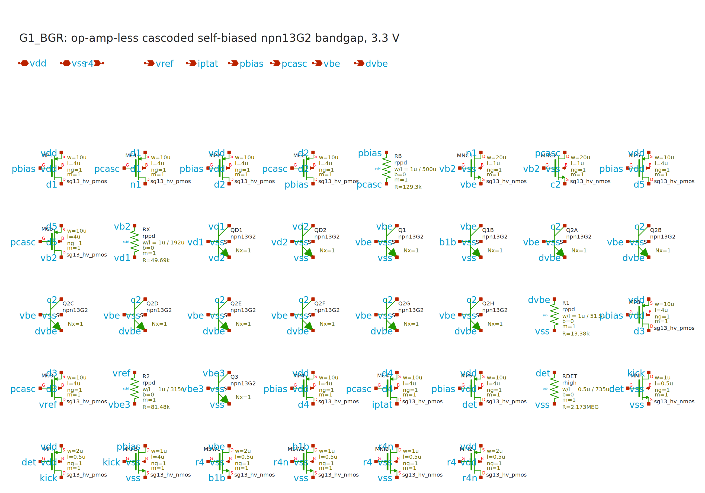{width=6.2in}

```{=openxml}
<w:p><w:r><w:br w:type="page"/></w:r></w:p>
```

## G1_T2F source-sheet overview

Vector view: `designs/g1-guardian/review/schematics/g1_t2f.svg`. Source paths and simulation evidence are indexed in the corresponding block section.

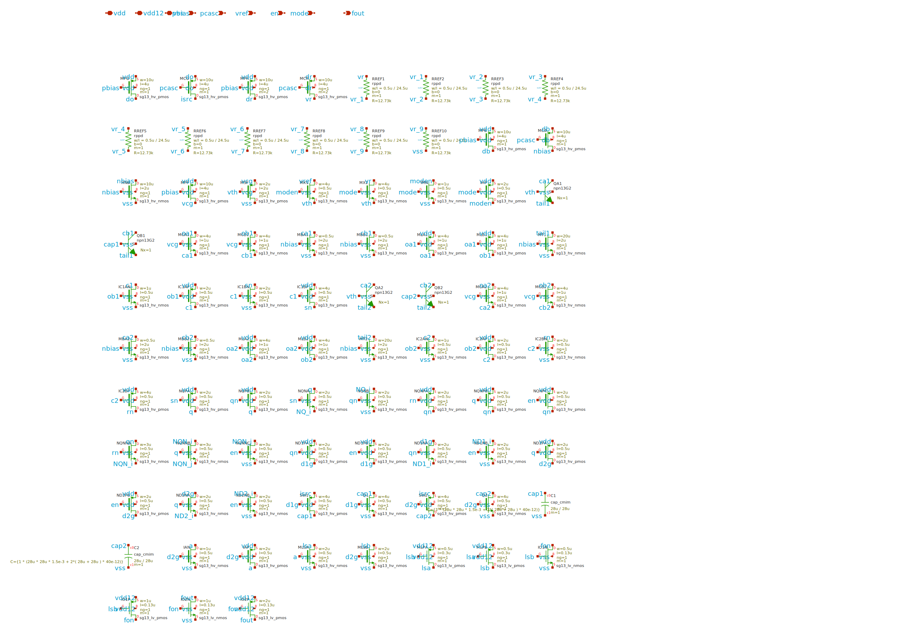{width=6.2in}

```{=openxml}
<w:p><w:r><w:br w:type="page"/></w:r></w:p>
```

## G1_OSC source-sheet overview

Vector view: `designs/g1-guardian/review/schematics/g1_osc.svg`. Source paths and simulation evidence are indexed in the corresponding block section.

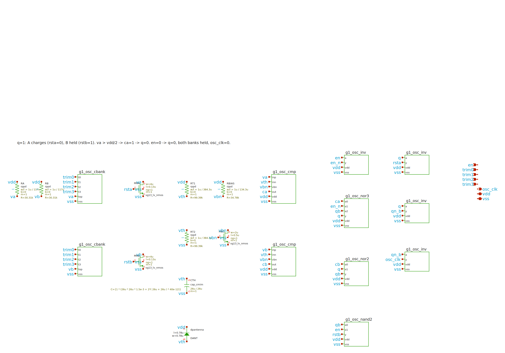{width=6.2in}

```{=openxml}
<w:p><w:r><w:br w:type="page"/></w:r></w:p>
```

## G1_SENSE source-sheet overview

Vector view: `designs/g1-guardian/review/schematics/g1_sense.svg`. Source paths and simulation evidence are indexed in the corresponding block section.

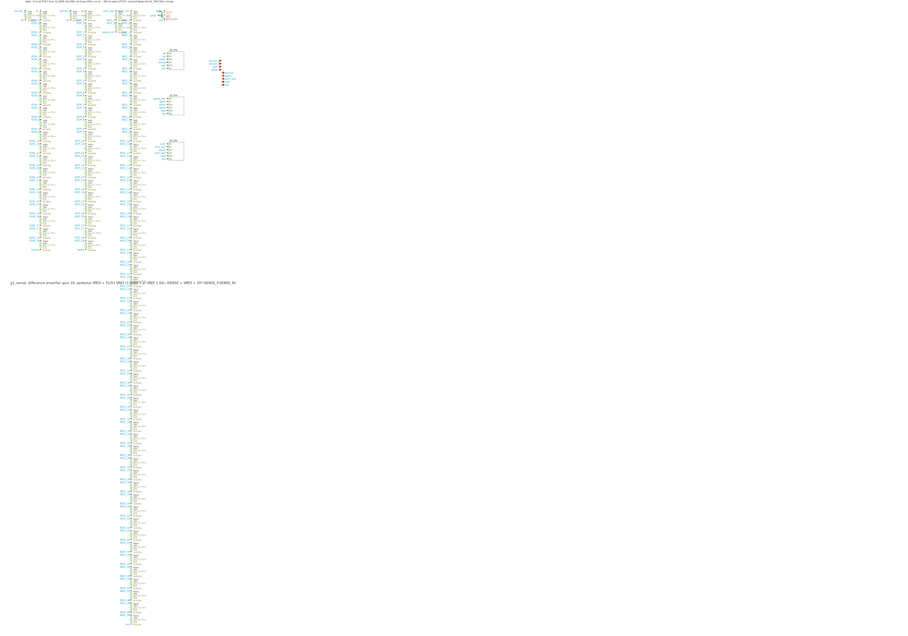{width=6.2in}

```{=openxml}
<w:p><w:r><w:br w:type="page"/></w:r></w:p>
```

## G1_TRIP source-sheet overview

Vector view: `designs/g1-guardian/review/schematics/g1_trip.svg`. Source paths and simulation evidence are indexed in the corresponding block section.

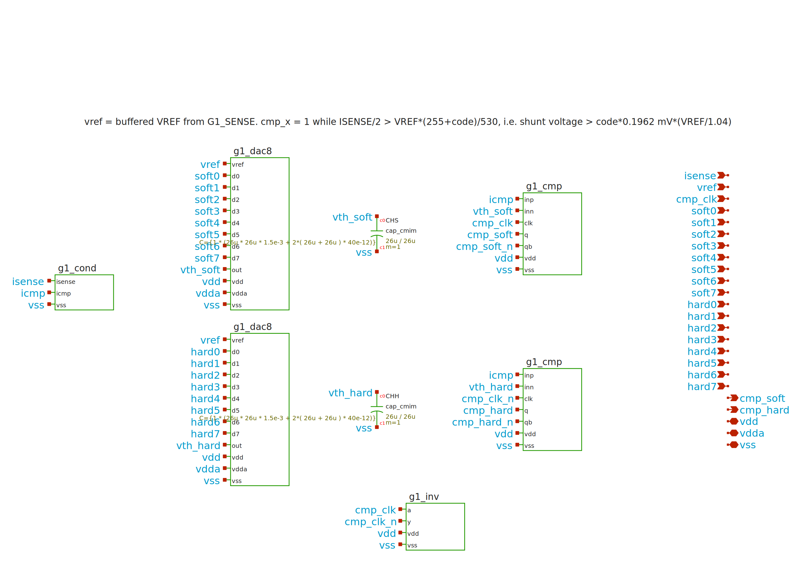{width=6.2in}

```{=openxml}
<w:p><w:r><w:br w:type="page"/></w:r></w:p>
```

## G1_GATE source-sheet overview

Vector view: `designs/g1-guardian/review/schematics/g1_gate.svg`. Source paths and simulation evidence are indexed in the corresponding block section.

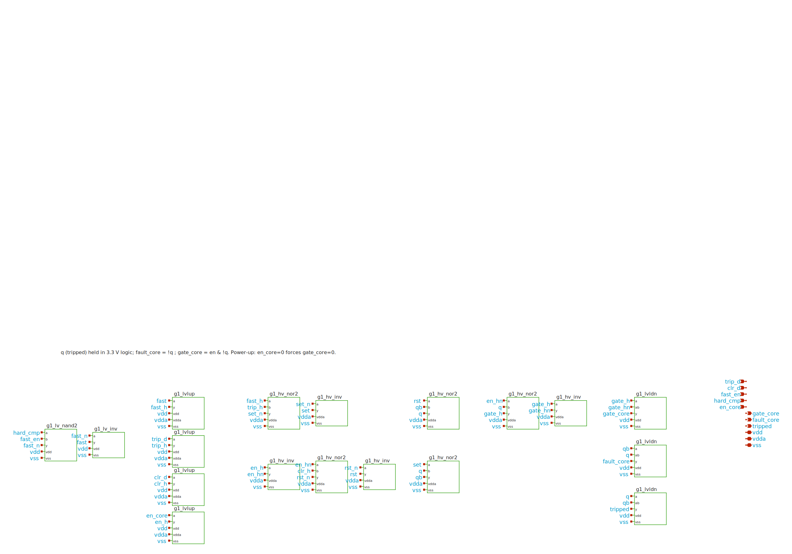{width=6.2in}

```{=openxml}
<w:p><w:r><w:br w:type="page"/></w:r></w:p>
```

# Bounded restart diagnostics

New simulated evidence from 21 September 2026. The runner now writes simulator output to disk during execution, records progress and input hashes, and enforces a wall-time watchdog. Diagnostic prefixes have their own valid observations; they do not claim completion of later fault events. Device models, extracted capacitances, RTL and stimulus were unchanged for these runs.

| Diagnostic | Status | Wall time / observation |
| --- | --- | --- |
| Schematic OP | passed | 15.0 s |
| Schematic 0–0.2 µs | passed | 20.0 s |
| PEX OP | passed | 25.0 s |
| PEX 0–1 µs | passed | 50.1 s |
| PEX 0–4 µs | passed | 135.1 s |
| PEX target 0–10 µs | not run to completion (watchdog) | 300.0 s; last reported time 7.551 µs |

The PEX circuit has 21,112 equations versus 17,486 for the schematic model. Its completed 4 µs prefix used 2,429 accepted and 339 rejected transient points, with 7,220 transient iterations. Simulator-reported time was approximately 60.7 s matrix loading, 53.9 s factorization and 5.9 s solve. These are observed costs for this execution environment, not a CPU-scaling prediction.

At 4 µs, after EN activation, simulated VREF was 1.039244 V, ISENSE 1.498102 V and GATE 3.200007 V. Serial configuration begins around 18–21 µs and the hard load step is at 30 µs: neither is covered by these short runs, and the default inrush mask is still active. Full integrated hard-trip and power-up completion remains **not run** in this restart.

The completed diagnostics retained startup warnings and gmin recovery. A separate forced-timeout test preserved simulator output and classified the actual child signal exit independently of the wrapper timeout exit. The corrected isolated clock-bridge regression also passed. These tests establish diagnostic observability and early startup progress; they do not establish the cause of the historical 32-hour interruption.

Exact commands, per-run tags, settings, input hashes and numerical warnings: `designs/g1-guardian/blocks/g1_top/sim/DIAGNOSTICS_20260921.md`; corresponding `logs/`, `decks/` and `results/waves/` beneath the same simulation directory. ngspice 46 and the pinned SG13G2 models were used. This appendix supplements the earlier interrupted-run record; it does not replace its status.

```{=openxml}
<w:p><w:r><w:br w:type="page"/></w:r></w:p>
```

## Newly completed PEX startup waveform

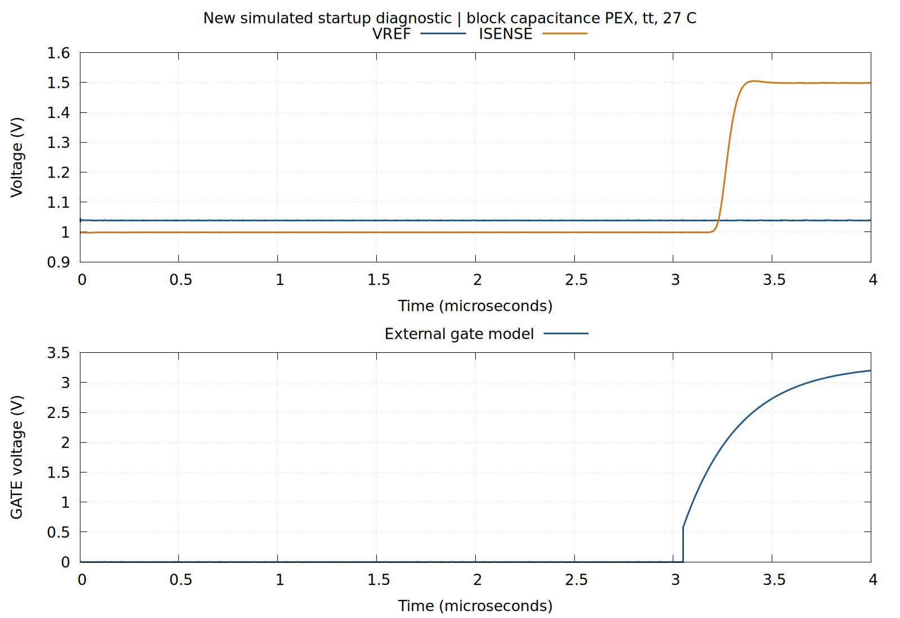{width=6.2in}

**Simulated, newly completed diagnostic:** existing BGR/SENSE/TRIP/GATE capacitance-PEX models with actual RTL, ideal clock and fitted output-pad model, tt, 27 °C. The plotted interval starts at zero and ends at 4 µs. Supply ramps, serial configuration, a fault event and arbitrary power-up safety are not tested by this view.

Source: `designs/g1-guardian/blocks/g1_top/sim/results/waves/c_pex_tl_tt_27C_clockfix_t4_prefix_s2_20260921_pex4us.txt`. Reproduce the plot from saved data with `flow/run.sh gnuplot designs/g1-guardian/review/results/restart_pex.gp`.
