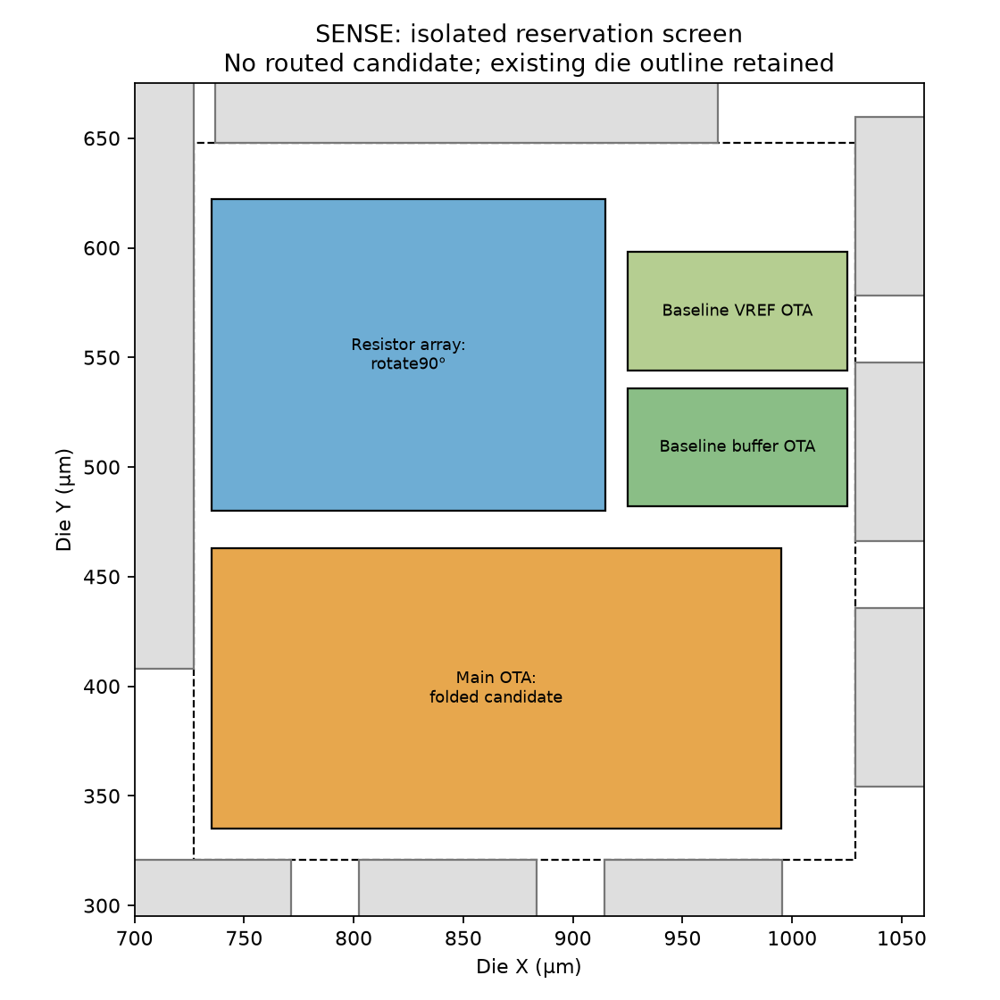

# SENSE enlarged-main-OTA footprint screen

The selected schematic candidate needs a substantially different main-OTA placement. Its widest unchanged row arrangement would be 846.36 µm, versus the existing main OTA's 97.85 µm total width. Folding rows and relocating existing SENSE resources are necessary. A nearby-space accounting does **not establish fit**; raw device area alone does not exclude a broader rearrangement within the current die.

Candidate: `blocks/g1_sense/sim/qualification/mc-gm3-matching16-comp2p5-smoke-20260922-a/sense_substrate_tied.spice`, with adjacent `geometry_comparison.json`. Only XOTA uses `g1_ota_main_candidate`; XBUF/XREF remain unchanged. Main XM1/XM2 each W=288 µm, L=2 µm, ng=48; XM3/XM4 each W=320 µm, L=4 µm, ng=40; XM14/XM11/XM15/XM12 each W=384 µm, L=4 µm, ng=48; XCC=57.5×23 µm.

The audit instantiates unchanged pinned-PDK PCells in an **isolated footprint inventory**, then compares their actual complete bounding boxes with baseline variants. `sense-candidate-area-20260922-r2/isolated_footprint_inventory.gds` is not a candidate circuit: devices are deliberately separated, with no interconnect or layout acceptance. Input hashes, instance dimensions, and delivered placements are retained in its `summary.json`. Delivered GDS and generators are unchanged.

| Geometry accounting | Baseline (µm²) | Candidate (µm²) |
|---|---:|---:|
| Changed MOS native PCell bounding boxes | 1,507.36 | 12,686.69 |
| Main-OTA MIM native bounding box | 585.64 | 1,420.54 |
| All main-OTA MOS native bounding boxes | 2,495.34 | 13,674.66 |
| Main OTA complete existing boundary | 5,009.92 | not laid out |
| Complete SENSE existing boundary | 47,721.28 | not laid out |

Native PCell boxes include contacts/implant/well enclosure; external layout guard rings, common-centroid folding, dummies, routing channels and rail contacts still need allocation. Legal enclosure overlap can reduce bounding-box sums. MIM occupies upper layers and can overlap MOS rows: its area must not be added as a rigorous two-dimensional packing lower bound.

Using the existing finger pitch `L+0.38 µm` and row gap 1.4 µm, N-row width changes 77.06→399.86 µm, PA-row width 71.64→846.36 µm, and the combined input-pair active width 76.46→228.78 µm. These are literal row estimates, not a proposed floorplan. Any folded arrangement must reestablish matching neighbors, first moments, well/body ties, routing balance, and extracted stability.

The actual assembled SENSE boundary is x=733–985.16, y=440–629.25 µm. A broad local screening rectangle x=727–1029, y=408–648 has 72,480 µm², bounded by digital at the west, TRIP to the north, and the right IO inward edge. It is not wholly available: baseline SENSE already occupies 47,721.28 µm² and PDN/decaps/routes use surrounding space. South of the chosen rectangle was not investigated. No neighboring block or ring has been moved.

For scale only, retaining the existing complete-main-OTA/native-MOS ratio (about 2.008) predicts roughly 27,455 µm² for the enlarged main OTA, and 70,166 µm² for the full SENSE macro with other resources retained. This estimate approaches the entire 72,480 µm² local rectangle before explicit new route/guard clearances. It is an uncertain overhead extrapolation, **not a fit, DRC, density, or routing result**. An actual folded floorplan is needed before any physical adoption decision.

Reproduce with unused output path:

```sh
G1_CPUS=1 flow/run.sh python3 designs/g1-guardian/review/audits/audit_sense_candidate_area.py --output designs/g1-guardian/review/audits/sense-candidate-area-new
```

KLayout 0.30.9; installed PDK revision `84374023ee8b4b126bebbba67fcbada0a9c0ff0b`. R1 is retained; r2 adds all-baseline-MOS footprint accounting. No PDK, golden reference, model, or delivered geometry was altered. Candidate DRC/LVS/PEX, density, route matching and physical fit are **not run**.

## Bounded southward regrouping screen

A subsequent read-only screen includes the corridor south of the prior y=408 µm envelope, down to the actual bottom IO inward edge y=321 µm. The enlarged local rectangle x=727–1029, y=321–648 is 98,754 µm² and remains inside the unchanged die/ring. `sense-fold-screen-20260922-r1` supplies a concrete **reservation diagram**, not routed candidate geometry:

- Main OTA: 260×128 µm at x=735–995, y=335–463.
- Resistor network reserved 180×142 µm at x=735–915, y=480–622, allowing a 90° rotation of the existing approximately 132.50×170.48 µm guard-and-track envelope.
- Two unchanged buffer/reference OTA cells reserved 100×54 µm each at x=925–1025, y=482–536 and y=544–598.

The reservations are inside the rectangle, do not overlap each other, and do not overlap any other existing macro or IO-cell bounding box. These limited arithmetic checks **passed**. Existing decaps, fill, PDN and assembly routes within this area would need regeneration; they are not empty usable space in the delivered GDS. The right buffer reservation approaches the IO boundary within 4 µm, so final guard/ESD/route clearance remains unqualified.

A bounded main-OTA folding concept divides each of the four enlarged PA devices into four equal 12-finger chunks arranged `ABCD / DCBA / CDAB / BADC` in four rows. Every device has the same column and row centroid. M3/M4 use four equal 10-finger chunks each, arranged `ABBA / BAAB` in two rows; the input pair uses 96 fingers with repeated ABBA assignment. Finger-count and first-moment arithmetic passed; exact logical pin mapping, native enclosures, routing and device extraction have **not** been implemented. The main height reservation allocates 27 µm to NMOS rows/fixed devices, 53 µm to PA rows, 10 µm to the input row, 12 µm to the unchanged PC row, and 24 µm for intergroup/outer allowance. This is a space budget, not a DRC-clean placement. Physically splitting fingers must not silently change schematic parameters or mismatch sample semantics.



This screen identifies a plausible regrouping to investigate after electrical qualification; it does not prove a routed fit or authorize adoption. Full guards/taps, matching, pin placement, route congestion, density, antenna, LVS and new extracted stability remain **not run**. No actual cell or shape was moved. Reproduce the screen with `G1_CPUS=1 flow/run.sh python3 designs/g1-guardian/review/audits/screen_sense_fold.py --output <unused-directory>`.
