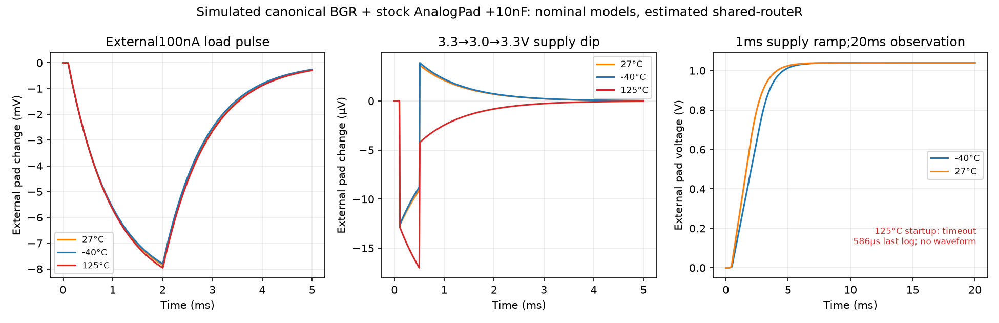

# VREF with actual pad and declared 10 nF board capacitor

Eight of nine selected nominal-model transient cases completed; **125°C startup timed out** after 120 s wall time, last reported simulation time 585.970 µs. Its requested 5 ms endpoint and final waveform were not obtained. Two additional cold/nominal startup extensions completed 20 ms. No hot retry, model change, or tolerance relaxation was used. Dynamic performance acceptance remains **not run** because this screen has no assigned settling/error tolerance.

The fixture copies the canonical BGR capacitance-PEX and actual unchanged AnalogPad from the [DC loading audit](VREF_PAD_LOADING_20260922.md), retains ideal 1 V IPTAT termination and original 1 pF core capacitance, and adds the 10 nF external VREF capacitor declared by the top fixture. Route R = 613.3425 Ω is the same entire-shared-tree series sensitivity, not exact branch extraction. The pad's internal protection resistance remains in the stock cell. VDD=1.2 V, BGR/IOVDD=3.3 V, ideal common ground; nominal model sections with ambient −40/27/125°C. Package ESR, inductance and leakage, actual downstream SENSE/T2F loading, other supply-sequencing orders, corners and mismatch are **not run**.

The load case starts at solved DC, applies 100 nA at external pad from 110 µs through 2 ms (10 µs edges), then recovers through 5 ms. The dip case starts at DC and lowers the common BGR/IO rail from 3.3 to 3.0 V between 110 and 500 µs (10 µs edges), restoring 3.3 V at 510 µs. Startup uses `uic` with both supplies ramping linearly from zero to nominal in 1 ms. Its always-present ideal 1 V IPTAT termination is a fixture limitation; this is not a real-chain power-sequencing qualification.

| Ambient | Load: maximum core droop | Load: maximum external-pad droop | Pad residual error at 5 ms | Dip: external-pad excursion |
|---|---:|---:|---:|---:|
| −40°C | 7.6881 mV | 7.7938 mV | −0.2614 mV | −12.59 to +3.89 µV |
| 27°C | 7.7387 mV | 7.8442 mV | −0.2713 mV | −12.67 to +3.64 µV |
| 125°C | 7.8465 mV | 7.9517 mV | −0.2933 mV | −17.01 to approximately 0 µV |

With the 10 nF load, startup at 27°C reaches only 1.02494 V core VREF by 5 ms versus its solved DC target 1.03929 V. The 20 ms extensions settle to within about 1.1 nV of their numerical DC targets; this is numerical agreement, not physical accuracy. Descriptive external-pad settling times, measured from start of the supply ramp and remaining within each band through 20 ms:

| Ambient | Within 1% of DC | Within 0.1% of DC |
|---|---:|---:|
| −40°C | 5.8085 ms | 7.8405 ms |
| 27°C | 5.3005 ms | 7.3495 ms |
| 125°C | not run to completion | not run to completion |

These bands characterize the data; they are not adopted product limits. The hot stall could involve the previously observed diode-model issue, but this audit does not isolate its mechanism and must not assert that root cause. Completing the cold/nominal ramp does not dispose of the hot failure.



Raw evidence: `vref-pad-dynamic-20260922-r1` (27°C three cases), `r2` (−40/125°C six cases including timeout), and `r3` (−40/27°C 20 ms startup extensions). Each retains generated decks, runner snapshot, tool logs, watchdog JSON, waveforms where completed, hashes and manifest. PDK/model/image pins are inherited in each provenance record. The final analyzer/JSON/SVG/PNG are `vref-pad-dynamic-summary-20260922-r2`; summary r1 retained a mistaken false timeout flag caused by checking the wrong watchdog status spelling, corrected in r2. The raw timeout evidence never changed.

```sh
G1_CPUS=1 flow/run.sh env OPENBLAS_NUM_THREADS=1 OMP_NUM_THREADS=1 python3 designs/g1-guardian/review/audits/run_vref_pad_dynamic.py --output designs/g1-guardian/review/audits/vref-dynamic-new --temperatures=-40,27,125
G1_CPUS=1 flow/run.sh env OPENBLAS_NUM_THREADS=1 OMP_NUM_THREADS=1 python3 designs/g1-guardian/review/audits/run_vref_pad_dynamic.py --output designs/g1-guardian/review/audits/vref-startup-extended-new --temperatures=-40,27 --cases startup --stop-ms 20
```

Installed model cards, rule decks, canonical circuits, and delivered geometry are unchanged. This screen closes a selected response characterization, not full V17, startup, stability, or pad acceptance.
