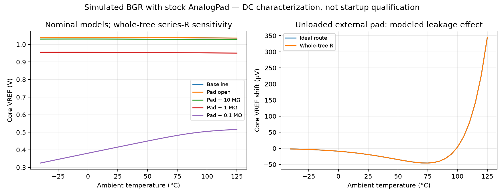

# VREF pad loading: nominal DC characterization

The baseline BGR output is sensitive to external loading through the actual stock AnalogPad. A simulated 10 MΩ external load lowers core VREF by 9.07 mV at 25°C; a 1 MΩ load lowers it by 84.6 mV. The open pad alone produces a temperature-dependent shift from −45.5 µV to +344.6 µV. These results require a high-impedance bench measurement strategy: input resistance, leakage, and protection must be included in its error budget. A 10 MΩ instrument input is not negligible. No numerical bench acceptance limit is assigned here.

All nine DC sweeps **passed solver/completeness checks**, with 34 temperatures from −40 to 125°C each. Performance acceptance is **not run**: no loading tolerance was supplied. Startup, process corners, mismatch, real downstream SENSE/T2F loading, and package leakage are **not run** in this fixture. The existing antenna-diode transient issue is not resolved by DC convergence.

## Fixture and provenance

The copied canonical baseline is `blocks/g1_bgr/sim/qualification/runs/bgr_array_baseline_nominal_20260921_01/nominal.cir` with sibling `pex_nominal.spice` and `.spiceinit`. Baseline VREF, IPTAT termination current, and supply current match all 34 original rows exactly. The original sources are unchanged. IPTAT retains its ideal 1 V termination; VREF retains its original 1 pF capacitor.

Pad cases instantiate the unchanged installed `sg13g2_IOPadAnalog` with core VDD = 1.2 V, IOVDD = 3.3 V, common ideal ground, core `padres` connected to BGR VREF, and external load at `pad`. Both an ideal route and a declared series-resistance sensitivity are exercised. The latter sums the entire shared VREF route tree: 841.565 µm, 433.3425 Ω wire plus nine single-cut Via2 crossings at 20 Ω each, total 613.3425 Ω. This is a conservative whole-tree series sensitivity, **not extracted BGR-to-pad resistance**; otherwise unloaded SENSE/T2F branches are included. Ground capacitance estimate 77.8816 fF is split at the two route terminals and has no DC effect. Geometry and layer-parameter evidence: `vref-route-geometry-20260922-r1.json` and `external-route-rc-estimates-20260921.json`.

Pinned PDK: `84374023ee8b4b126bebbba67fcbada0a9c0ff0b`; ngspice 46; image `sha256:5fd78498e578c6e9ec10828c248ca3790fc88250ff6caf545521b29e448ea3c0`. Unchanged HBT/HV MOS/resistor models use nominal sections; stock pad additionally uses nominal LV MOS/capacitor/diode sections. Input hashes and versions are retained in `vref-pad-loading-20260922-r2/provenance.json`. No model card, rule deck, canonical netlist, or GDS changed.

## Simulated results

25°C values, with ideal route:

| External pad load | Core VREF (V) | Change from baseline (mV) | External pad (V) | Current into pad network (nA) |
|---|---:|---:|---:|---:|
| No pad, baseline | 1.039342729 | 0 | not applicable | not applicable |
| Open | 1.039323622 | −0.019108 | 1.039323538 | 0.217745 |
| 10 MΩ | 1.030275010 | −9.067720 | 1.030214783 | 103.237556 |
| 1 MΩ | 0.954749648 | −84.593082 | 0.954192518 | 954.395046 |
| 100 kΩ | 0.413049656 | −626.293074 | 0.410652251 | 4106.639731 |

The 613.3425 Ω sensitivity gives core VREF 1.030275562 / 0.954797782 / 0.415567809 V for 10 MΩ / 1 MΩ / 100 kΩ respectively, and external pad 1.030152024 / 0.953655924 / 0.410651635 V. BGR output loading dominates this particular routing sensitivity. The 100 kΩ case is strongly nonlinear and must not be extrapolated as a constant output resistance.

Across temperature, the open pad draws between −3.84828 and +0.514034 nA; negative current means injection into VREF. Its largest core shift is +344.558 µV at 125°C. Box temperature coefficient `(max−min)/(V25×165°C)` changes from 22.5578 ppm/°C baseline to 20.5060 ppm/°C with open pad, and 21.8188 / 30.8806 / 2808.04 ppm/°C at 10 MΩ / 1 MΩ / 100 kΩ. The apparent open-pad improvement is leakage cancellation in this nominal model, not a robust compensation claim.



## Reproduction and retained failures

From the repository root (choose unused output paths):

```sh
G1_CPUS=2 flow/run.sh env OPENBLAS_NUM_THREADS=1 OMP_NUM_THREADS=1 python3 designs/g1-guardian/review/audits/run_vref_pad_loading.py --output designs/g1-guardian/review/audits/vref-pad-loading-new
G1_CPUS=2 flow/run.sh env OPENBLAS_NUM_THREADS=1 OMP_NUM_THREADS=1 python3 designs/g1-guardian/review/audits/analyze_vref_pad_loading.py --run designs/g1-guardian/review/audits/vref-pad-loading-new --output designs/g1-guardian/review/audits/vref-pad-loading-summary-new
```

Run r2 retains every generated deck, per-leaf tool log, watchdog status, waveform, runner snapshot, and aggregate manifest. Summary r1 retains analyzer, JSON, SVG, and PNG. Initial run `vref-pad-loading-20260922-r1` **failed during LEF parsing before simulation**; its snapshot, log, and disposition remain. The parser was corrected to accept the installed LEF's case and whitespace; no PDK file was modified.

This result applies to the canonical baseline only. Unadopted enlarged BGR candidates have not been tested by this fixture. No result here closes full IO LVS, macro stability, pad startup, or assembled power/IR qualification.
